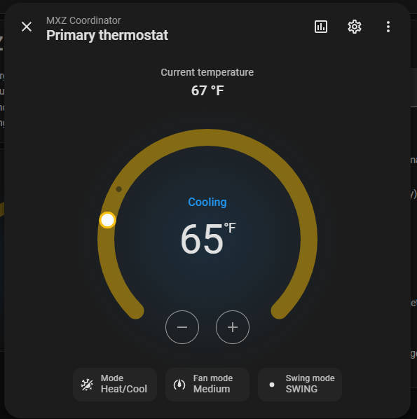
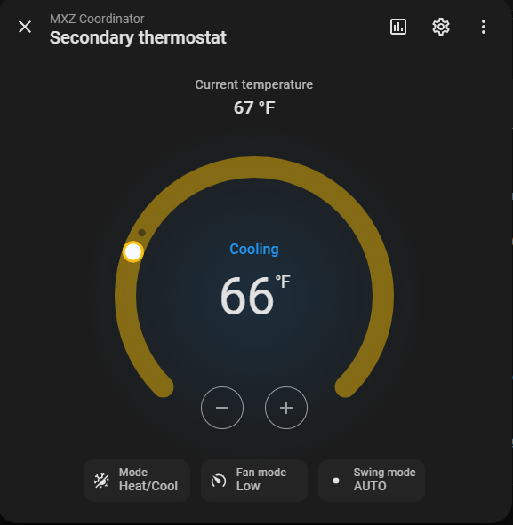

# MXZ Coordinator

**Single-target control for Mitsubishi MXZ multi-zone mini-splits.** Several indoor heads
share one outdoor unit; this coordinates them so they stop fighting over the shared
compressor. Set **one temperature per room** — like a Tesla, it handles mode, fan, and
arbitration in the background.


> Shared as-is; support is best-effort ([Caveats](#caveats)). Built with AI assistance
> (Claude); every line reviewed, tested, and run in production on my own system.

[](https://my.home-assistant.io/redirect/hacs_repository/?owner=dkpnw&repository=ha-mxz-coordinator&category=integration)
[](https://my.home-assistant.io/redirect/config_flow_start/?domain=mxz_coordinator)

**Install:** Add to HACS → download → restart → Add Integration → pick your heads and one
temperature sensor per room. No YAML, no helpers. [Details below.](#install)

**Works with your existing setup.** The coordinator sits on top of whatever already exposes
your heads to Home Assistant — no firmware changes, no new hardware. Built and validated
against [echavet/MitsubishiCN105ESPHome](https://github.com/echavet/MitsubishiCN105ESPHome),
the reference open-source ESP32/CN105 firmware for Mitsubishi heads; any integration that
exposes standard `climate` entities with heat/cool modes (Kumo Cloud, MELCloud, …) should
work too.

---

## Why: the MXZ AUTO deadlock

An MXZ outdoor unit has **one compressor and one reversing valve** — it can heat or cool at
any instant, never both. In hardware **AUTO**, each head votes from its own room and the
lowest-address head is the mode master, so an idle head sitting in its deadband can hold
the outdoor unit neutral while the room that's actually calling is parked in standby.
Mitsubishi's own manuals say so: AUTO is *"not recommended if this indoor unit is connected
to a MXZ type outdoor unit… the indoor unit becomes standby mode"* (MSZ-SF); *"cooling and
heating cannot be done at the same time… the unit selected last goes into standby mode"*
(MSZ-GE).

Measured on real hardware: a room 6 °F from its cooling target sat at **~26 W for over an
hour** because the other head was satisfied. The moment that head was turned off, the
starved one ramped to ~460 W.

**The fix:** never run hardware AUTO. The coordinator keeps every head in **one explicit
mode** (`cool` or `heat`), chosen from actual room temperatures vs. their targets, and a
satisfied head idles in **`fan_only`** — which the outdoor unit's service manual (OCH573E)
confirms *fully closes that head's LEV* — so it stops drawing refrigerant instead of
blocking its neighbors. The same scenario, coordinated:

```
 20s  675W  primary cool/high | secondary idle (satisfied)
 80–220s 45W  compressor short-cycle off (~2.5 min, normal)
240–380s 101→609W  both rooms served, sustained
```

Over an hour of starvation under AUTO; both rooms served within minutes under the
coordinator.

---

## Features

### Comfort & control
- **One temperature per room** — the coordinator picks heat vs. cool to reach it. Change it
  from HA, HomeKit, Google, or Assist.
- **Per-room enable switches** — turn one room off without touching the others.
- **Priority-aware standoffs** — when rooms disagree, the highest-priority room wins and the
  other idles; nobody oscillates. A 10-minute hysteresis gates every mode flip.
- **Runs to your number, then coasts** — a room conditions until it hits its target, idles
  in `fan_only`, and resumes once it drifts past the **re-engage drift** (adjustable,
  0.5–5 °F / 0.25–2.5 °C). A satisfied room is never dragged along by its neighbor.
- **Resting-mode bias** — what the system settles into when nobody's calling: last mode used
  (default), or pinned cool/heat for one-sided climates.

### Fan & vanes
- **Delta-proportional fan** (on by default) — ramps toward max when far from target, steps
  down with hysteresis as the room closes in, returns to the firmware's `auto` when
  satisfied. Max speed configurable; opt out anytime.
- **Manual fan hold** — reach in and pick a fan speed yourself and the coordinator backs off
  that head entirely: it stops writing the fan, and won't yank you back to `auto` when the
  room settles. Set the fan to `auto` to hand control back — or, since HomeKit's slider has no
  `auto` stop, just slide it to max when boost is already running flat out and I take that as
  "you drive," resuming automatic control.
- **Correct Mitsubishi fan ladder** — knows `middle` is *faster* than `medium` (a real CN105
  naming trap) and never commands a speed your unit lacks.
- **Vane & swing on the tile** — full louvre control from the native thermostat.
- **Vane kick** — change a vane while the head is off (eco/away) and the coordinator briefly
  wakes it to physically apply the position, then puts it back to sleep.

<p align="center">
  
  
</p>
<sub>Fan dynamics live: the bedroom (~2° out) at <b>Medium</b> while the rec room (~1° out) has eased to <b>Low</b>.</sub>

### Weather & seasons
- **Local-weather changeover** — point it at any `weather.*` entity or outdoor temperature
  sensor and it locks out heating in the warm season / cooling in the cold one from *your*
  forecast, with a hysteresis band so shoulder seasons don't flap. No weather entity? HA's
  built-in Met.no is one click.
- **Passive-solar heat lockout** — a slightly-cool room waits for the sun instead of burning
  compressor energy; a safety floor still heats a genuinely cold room.
- **Cool lockout** — the winter mirror, with a safety ceiling for genuinely hot days.
- **Away/eco mode** — one switch parks every head OFF unless a room crosses wide protection
  extremes (default 78/50 °F).

### Hardware protection
- **Mode-flip hysteresis** (default 10 min) — the shared compressor is never rapid-cycled.
- **Firmware-band clamping** — every setpoint clamped to the unit's real range before
  sending; no rejected commands.
- **Idempotent writes** — commands only when something actually needs to change.
- **`fan_only` idling closes the valve** — satisfied heads stop drawing refrigerant.

### Reliability & trust
- **Self-healing** — a head knocked into `heat_cool`/`auto`/`dry` (wall remote, curious
  guest) or off-while-enabled is put back on plan, after a debounce.
- **Drift alerts** — optional phone notification whenever a self-heal fires.
- **Restart-proof** — every target, enable, mode, and switch restores across HA restarts.
- **Sensor-dropout fail-safe** — a room whose sensor goes unavailable fails to *neutral*
  (no conditioning on garbage data) and recovers automatically.
- **Durable config** — options saves merge instead of replace, and settings are mirrored so
  a corrupted save self-recovers instead of resetting to defaults.
- **One-switch kill** — flip the coordinator off and your heads are instantly yours again,
  frozen where they were.
- **A transparent brain** — the plan sensor exposes every decision input live (per-room
  demand/engage, standoff, hysteresis countdown), so "why did it do that?" has an answer.

### Fit & finish
- **One-click install** — HACS + config flow; every option shown at setup with sensible
  defaults.
- **°C and °F, automatically** — adapts to your HA unit, with 0.5° resolution and clean
  metric defaults on °C.
- **Native HomeKit / Google / Assist tiles** — one clean dial per room, never a raw
  dual-setpoint firmware control.
- **2–8 zones per outdoor unit** *(v3 beta)* — plus multiple outdoor units, one entry each.
  Existing 2-zone installs migrate automatically with no entity changes.
- **Automation-friendly** — a `recompute` service and event hook; every threshold tunable
  in the UI.

---

## How it works

The coordinator is the **sole writer** of the heads, in three parts (Python in
`custom_components/mxz_coordinator/`; mirrored 1:1 by the legacy
[`packages/mxz_coordinator.yaml`](packages/mxz_coordinator.yaml)):

1. **Decide** — `sensor.*_plan`, side-effect-free. Two thresholds: **demand** (default 3 °F
   off-target) before the shared mode may flip, primary wins standoffs, 600 s hysteresis;
   **re-engage drift** (default 1 °F): a running head goes all the way to its target, then
   coasts in `fan_only` until it drifts this far off. Eco/away swaps both for the wide
   protection extremes.
2. **Act** — the only component that commands heads. Derives each room's setpoint band from
   its single target (`cool → [target−2, target]`, `heat → [target, target+2]`), clamps to
   the firmware range (default `[59, 88] °F` / `[15, 31] °C`), sends both edges with the
   mode — or the single clamped target for heads whose firmware exposes only one setpoint —
   never `heat_cool`. Idempotent. Gated on the kill-switch. A head that rejects a command
   degrades only its own zone; the rest keep running.
3. **Trigger** — recompute on any decision-relevant change, a 15-min heartbeat, HA start,
   and the `mxz_recompute` event; plus the two self-heal paths.

All thresholds are option defaults, editable at setup or later under **Configure**. On a
metric system the defaults adapt (1.5° demand, 0.5° engage, 21 °C target, 20/10 °C
changeover); sensors and setpoints are read and written in your HA unit throughout.

### Who drives the fan

Automatic ramping and hands-on control coexist per head; the handoff between them is
deliberate, not a fight:

- **Boost drives by default.** While a head is actively running, its fan speed follows how
  far the room is off target — toward max when far out, easing down with hysteresis as it
  closes in, back to the firmware's `auto` once satisfied.
- **A manual pick is a hold.** Choose any speed yourself — HA, Apple Home, the unit's own
  controls — and I back off that head's fan entirely: no ladder writes, and no snapping you
  back to `auto` when the room settles. The hold survives restarts and the head cycling
  off, and it never times out on its own — a hold is your call until you hand it back.
  Each zone reports its hold as `fan_hold` on the plan sensor, so a dashboard can show
  who's driving.
- **Handing back.** Set the fan to `auto` and boost resumes on the next cycle. From
  HomeKit — whose fan slider has no `auto` stop — slide it to **max while boost would
  already be running flat out**: a max command that changes nothing reads as "you drive,"
  so I adopt it and resume control (still at max, ramping down as the room closes in).
  Slide to max when boost would be running *slower* than that, and it's a genuine request
  for more air — it holds at max like any other manual pick. Same if the head is idling or
  your boost ceiling is set below the head's top speed: max always holds there, because
  boost would never have chosen it.
- **A max hold folds back in; a slower hold waits for your gesture.** Holding at the head's
  top speed is never really a hold *above* auto — the moment the room drifts far enough (or
  you move the target) that boost would be commanding max anyway, the hold merges into auto
  and rides the ramp back down as the room closes in. A hold at any slower speed is a
  ceiling you chose: it never releases on drift or a target change, only on an observed
  `auto` (or the max handback above). I read fan state once per cycle rather than watching
  slider events, so re-selecting the speed a head is already on is invisible to me — change
  to something else first if you want a fresh gesture registered.

---

## Install

1. **[Add to HACS](https://my.home-assistant.io/redirect/hacs_repository/?owner=dkpnw&repository=ha-mxz-coordinator&category=integration)**
   → **Download**. (If the badge doesn't open: add this repo as a HACS custom repository,
   category *Integration*.)
2. **Restart Home Assistant.**
3. **[Add Integration](https://my.home-assistant.io/redirect/config_flow_start/?domain=mxz_coordinator)**
   → *MXZ Coordinator*.
4. Pick **all the heads on this outdoor unit** (2–8; selection order = standoff priority),
   then one **room temperature sensor** per head, and optionally a notify target for drift
   alerts. Vane controls are detected automatically. A final tuning step shows every option
   pre-filled — Submit as-is or adjust.
5. Turn on **Coordinator enable**, set each room's target, enable the rooms. Done.

<p align="center">
  
</p>
<p align="center">
  
</p>

Example day/night/away presets: [`examples/presets.yaml`](examples/presets.yaml).

**No HACS?** The original YAML package still ships
([`packages/mxz_coordinator.yaml`](packages/mxz_coordinator.yaml) +
[`docs/ENTITY-MAP.md`](docs/ENTITY-MAP.md)). Migrating from it to the integration is a
breaking change — see [`docs/MIGRATION.md`](docs/MIGRATION.md), and remove the package so
the two don't fight over the heads.

### Reconfiguring

Picked the wrong sensor, or adding/removing a head? Don't delete and re-add — use
**Settings → Devices & Services → MXZ Coordinator → ⋮ → Reconfigure**. It's prefilled with
the current heads and sensors; heads kept in the same position keep their name, vane wiring
(including your overrides), and target, and dropped zones' entities are cleaned up
automatically. One caveat: **reordering heads changes more than priority** — targets and
enables belong to the priority *slot*, not the head, so after a reorder re-check each
room's target. (Delete-and-re-add also has a trap: HA's restore cache can resurrect the old
install's values onto the new entities for up to ~7 days. Since v3.0.0-beta.7 the
coordinator detects and ignores those stale restores.)

### Removing

Delete the **config entry**, not the device: **Settings → Devices & Services →
MXZ Coordinator → ⋮ → Delete**. That removes the device, all of its entities, and the
`recompute` service cleanly — no restart needed. (The device page itself has no Delete
button by design: the device *is* the config entry — its **Visit** link brings you here.) Then remove the download from HACS —
**in that order**; removing from HACS first leaves a broken entry behind.

Your heads keep their last commanded state after removal — if they were parked `off` or
`fan_only`, set them how you want them via their own controls.

---

### Best practice: give the firmware your room sensor too

The coordinator reads your room sensors — but each head's own control loop still runs on its
internal thermistor, which reads several degrees warm when the unit is idle. Feed the SAME
room sensor to the firmware so both layers agree. On CN105/ESPHome that's a `homeassistant`
sensor bound via `remote_temperature_source`:

```yaml
sensor:
  - platform: homeassistant
    id: remote_temp_ha
    entity_id: sensor.your_room_temperature   # the same sensor you give the coordinator
    filters:
      - lambda: return (x - 32) * (5.0/9.0);  # only if your HA runs °F
      - clamp:                                # the firmware accepts 1–40 °C
          min_value: 1
          max_value: 40
          ignore_out_of_range: true

climate:
  - platform: cn105
    # ...
    remote_temperature_source:
      sensor_id: remote_temp_ha
    remote_temperature_timeout: 30min
    remote_temperature_keepalive_interval: 20s
```

The timeout is the safety: if the sensor drops out, the head falls back to its internal
reading instead of holding a stale number.

## Gotchas (read before you debug)

- **Per-zone power is shared, not per-head.** Only the lowest-address head reports the real
  outdoor-unit draw; the others read near-zero even while actively served. Never declare a
  head dead from its own power sensor.
- **Anti-short-cycle timing.** ~3-minute minimum compressor off-time in cooling; ~6 minutes
  to engage after a cool→heat reversal. `hvac_action` flips instantly; the draw lags. Normal.
- **`fan_only` is the design working**, not a fault — it's what keeps a satisfied head from
  starving the other room.
- **Respect the setpoint clamp.** Below-range setpoints made `climate.set_temperature` throw
  HTTP 500 on our heads — hence the clamp. Adjust it to your firmware's range.
- **Minimum-capacity floor.** The compressor can't modulate below ~40% of nameplate; excess
  can bleed into a satisfied head as mild overshoot. Not a deadlock.
- **Fan stuck at one speed?** That's a manual hold, not a bug — someone picked that speed,
  so I stopped driving the fan (check `fan_hold` on the plan sensor). Set the fan to `auto`
  to hand it back. See [Who drives the fan](#who-drives-the-fan).

---

## N zones (v3, beta)

v3 coordinates **2–8 heads on one outdoor unit** — selection order is standoff priority,
every zone gets its own target/enable/thermostat, and existing 2-zone installs migrate
automatically with no entity changes. Multiple outdoor units: one entry each (independent
mode, hysteresis, changeover, kill-switch — there's nothing to coordinate between
compressors). The 2-zone path is validated on real hardware; >2-zone is simulation-validated
and being beta-tested on real 6-zone and 2×3-zone systems —
[issue #4](https://github.com/dkpnw/ha-mxz-coordinator/issues/4). Out of scope: simultaneous
heat+cool (single-compressor MXZ hardware can't; that's branch-box VRF).

## Caveats

- Built on one real two-zone setup (MSZ heads, dual-setpoint firmware) and validated on a
  second: a three-zone system with single-setpoint heads, running the v3 beta
  ([#4](https://github.com/dkpnw/ha-mxz-coordinator/issues/4) — thanks @helicopterrun).
  Other models/firmware may still differ — especially the cool→heat reversal lag and the
  per-zone power blindness.
- The coordinator drives **any** HA `climate` heads; the native single-target thermostats
  are optional on top.

## The single-target thermostat surface

Each room ships as a native thermostat (`climate.*_thermostat`): one number + Heat/Cool
auto, rendered as a clean single-setpoint tile in HA/HomeKit/Google. It's a thin facade over
the room's `number.*_target` and `switch.*_enable` — the coordinator remains the sole writer
of the real heads. Expose these tiles (not the raw heads) to avoid two fighting controls per
room; fan and vanes pass through, bounded to the firmware band.

Legacy note: the YAML package got this surface from the CN105 proxy's
`coordinator_single_target` option. The integration no longer needs the proxy — its native
thermostats own the surface, and the `mxz_recompute` event is still honored so existing
proxy/automation nudges keep working.

## Credits & prior art

- [@helicopterrun](https://github.com/helicopterrun) — 3-zone hardware validation and
  relentless, root-caused QA through the v3 beta (#5, #6, #7).
- [BarrettPalmer/Smart-HVAC-Automation-for-Home-Assistant-Mini-Splits](https://github.com/BarrettPalmer/Smart-HVAC-Automation-for-Home-Assistant-Mini-Splits)
- [bjrnptrsn/climate_group_helper](https://github.com/bjrnptrsn/climate_group_helper)
- [bartmachielsen/smart_climate](https://github.com/bartmachielsen/smart_climate)
- Mitsubishi service/installation manuals (MSZ-SF, MSZ-GE, MXZ-18NV, OCH573E) for the
  AUTO-on-MXZ behavior and LEV documentation.

## License

[MIT](LICENSE).

---

*Not affiliated with, endorsed by, or associated with Mitsubishi Electric Corporation.
"Mitsubishi Electric" and the three-diamond logo are trademarks of their respective owner,
used here for identification/compatibility only.*
