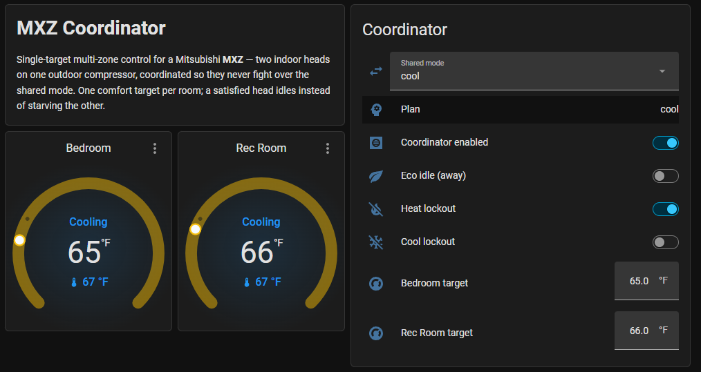
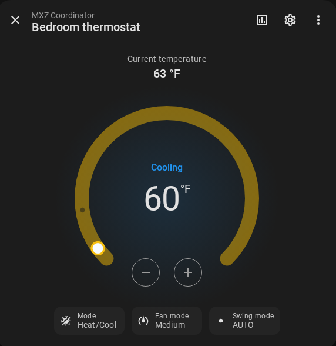
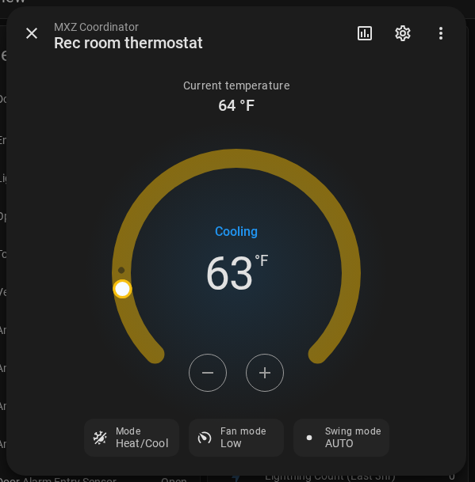
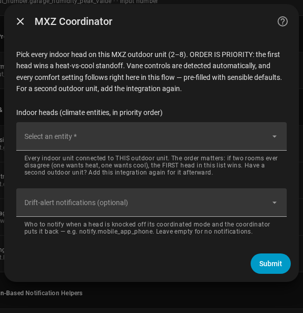
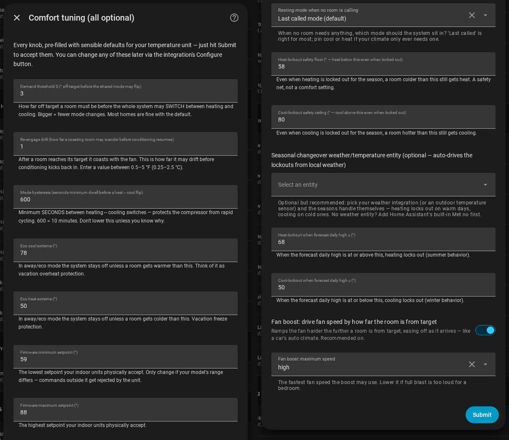

# MXZ Coordinator

**Set one temperature per room. The coordinator does the rest.**

Mitsubishi MXZ systems put several indoor heads on one outdoor compressor. In the stock
AUTO mode, the heads fight over it — and the losing room sits in standby for hours. I
measured it: a room 6 °F too hot drew **26 W for over an hour** while a satisfied head
blocked it. The coordinator ends the fight — Tesla-style: you set one number per room,
and it handles mode, fan, and arbitration in the background. It reads your real room
temperatures, picks heat or cool for the whole system, and never lets a satisfied room
block a calling one.



[](https://my.home-assistant.io/redirect/hacs_repository/?owner=dkpnw&repository=ha-mxz-coordinator&category=integration)
[](https://my.home-assistant.io/redirect/config_flow_start/?domain=mxz_coordinator)

**Install:** Add to HACS → Download → restart → Add Integration → pick your heads and one
temperature sensor per room. No YAML. [Details below.](#install)

> Shared as-is; support is best-effort ([Caveats](#caveats)). Built with AI assistance
> (Claude); every line reviewed, tested, and run in production on my own system.

**Works with what you have.** The coordinator drives any standard `climate` entity with
heat and cool modes — no firmware changes. Built and validated against
[echavet/MitsubishiCN105ESPHome](https://github.com/echavet/MitsubishiCN105ESPHome), the
open-source ESP32/CN105 firmware for Mitsubishi heads. Kumo Cloud and MELCloud expose the
same entity type and should work, but are untested — reports welcome. One requirement:
**a temperature sensor entity per room**. Any temperature sensor works — a $20 Bluetooth
thermometer is the good answer. If your head exposes its internal reading as a sensor
entity, that works too — but it reads several degrees warm when the unit is idle
([why that matters](#best-practice-give-the-firmware-your-room-sensor-too)).

---

## The problem: stock AUTO starves rooms

An MXZ outdoor unit has one compressor and one reversing valve. It can heat or cool at any
moment — never both. In hardware AUTO, each head votes from its own room, and the
lowest-address head (the head wired first) is the mode master. An idle head can hold the
outdoor unit neutral while another room calls and gets nothing. Mitsubishi's own manuals warn about this: AUTO
is *"not recommended if this indoor unit is connected to a MXZ type outdoor unit… the
indoor unit becomes standby mode"* (MSZ-SF); *"cooling and heating cannot be done at the
same time… the unit selected last goes into standby mode"* (MSZ-GE).

I measured it on my own system. A room 6 °F past its cooling target drew **~26 W for over
an hour** — parked in standby — because the other head was satisfied. The moment I turned
that satisfied head off, the starved room ramped to ~460 W and cooled.

The same scenario, coordinated — both rooms served within minutes instead of an hour of
starvation:

```
elapsed    draw       what's happening
0:20       675 W      hot room cooling hard; satisfied room idle in fan_only
1:20–3:40   45 W      compressor anti-short-cycle pause (~2.5 min — normal)
4:00–6:20  101→609 W  both rooms served, sustained
```

**The fix is three rules the stock logic doesn't have:**

1. **Never hardware AUTO.** Every head runs one explicit shared mode — `cool` or `heat` —
   chosen from your real room temperatures against your targets.
2. **A satisfied room steps aside.** It idles in `fan_only`, which fully closes that
   head's refrigerant valve (confirmed in the OCH573E service manual). It stops drawing
   capacity instead of blocking its neighbors.
3. **When rooms disagree, your priority wins.** The room you ranked first gets its mode.
   The other coasts until the system is free.

---

## What you get over the stock logic

### Comfort
- **One number per room.** Not a dual heat/cool band — one target, like a Tesla, and the
  coordinator picks the mode. Change it from HA, HomeKit, Google, or Assist.
- **Runs to your number, then coasts.** A room conditions until it *reaches* the target —
  not "close enough". Then it rests, and resumes only after it drifts past an adjustable
  band (0.5–5 °F / 0.25–2.5 °C). A satisfied room is never dragged along by its neighbor.
- **A fan that responds to need.** The firmware's own auto ramp is conservative. Fan
  boost (on by default) runs the fan harder the farther the room is from target and eases
  off as the room arrives — the way a Tesla's auto climate does — with hysteresis, so it
  never chatters. Max speed configurable.
- **Room sensors, not head sensors.** A head's internal thermistor reads several degrees
  warm when the unit is idle. The coordinator trusts the sensor you place where people
  actually sit.
- **Resting-mode bias.** When no room is calling, the system settles into the last mode
  used (default) — or pin it to cool or heat for one-sided climates.

<p align="center">
  
  
</p>
<sub>Fan dynamics live: the bedroom (3° out) at <b>Medium</b> while the rec room (1° out) has eased to <b>Low</b>.</sub>

### Control that stays yours
- **Pick a fan speed and it stays picked.** Set any speed by hand and the coordinator
  stops driving that fan — no snapping back to auto, no timeout. Each room has a
  **Fan auto** switch that shows who is driving and hands control back with one tap,
  including from Apple Home. Details: [Who drives the fan](#who-drives-the-fan).
- **Per-room enable switches.** Turn one room off without touching the others.
- **Away/eco mode.** One switch parks every head off unless a room crosses wide
  protection extremes (default 78/50 °F).
- **Grid-down / load-shed standby.** Watch any entity — a grid-status sensor, a
  load-shed switch, a vacation toggle. While it is active, every head drops into a
  low-power hold: the protection-only `eco` band by default (freeze-safe), or `off` /
  `fan_only`. When it clears, coordination resumes on its own. The hold is a separate
  gate from the kill-switch, so there is nothing to snapshot and nothing to restore.
  And if the watched entity drops out, the coordinator keeps coordinating — a stuck
  sensor never parks your house. (Designed and built by @calvindomenico, #12.)
- **One-switch kill.** Flip the coordinator off and your heads are instantly yours again,
  frozen where they were.
- **Vane control on the tile**, plus a **vane kick**: change a louvre while the head is
  off and the coordinator briefly wakes the head to move it. (A powered-off head cannot
  move its louvre and forgets the command at power-up — without the kick, your change
  silently does nothing.)

### Seasons & weather
- **Local-weather changeover.** Point it at any `weather.*` entity or outdoor temperature
  sensor. It locks out heating in the warm season and cooling in the cold one, from *your*
  forecast, with a band so shoulder seasons don't flap. No weather entity? HA's built-in
  Met.no is one click.
- **Passive-solar heat lockout.** A slightly-cool room waits for the sun instead of
  burning compressor energy. A safety floor still heats a genuinely cold room.
- **Cool lockout** — the winter mirror, with a safety ceiling for genuinely hot days.

### It doesn't break, and it tells the truth
- **Self-healing.** A head knocked off plan — wall remote, curious guest — is put back
  after a 20–30 s debounce. Optional phone alert when that happens.
- **Restart-proof.** Every target, enable, mode, switch — and fan hold — survives an HA
  restart: the **Fan auto** switch remembers whether you were holding, so a hold comes
  back as your hold and the boost's own speed comes back as the boost's. One honest edge:
  a fan speed set from a wall remote *while HA itself was down*, on a room that wasn't
  held before, can be read as the boost's own residue and cleared.
- **Sensor-dropout fail-safe.** A room whose sensor goes unavailable fails to *neutral* —
  no conditioning on garbage data — and recovers by itself.
- **If HA itself goes down**, the heads keep their last commanded state and their own
  control loops keep running — a cooling room keeps cooling on the head's thermistor. A
  room parked in `fan_only` stays parked until HA returns; the
  [remote-sensor timeout](#best-practice-give-the-firmware-your-room-sensor-too) keeps
  the head's own loop on honest data meanwhile.
- **Hardware protection.** A 10-minute minimum between mode flips protects the shared
  compressor. Every setpoint is clamped to the firmware's real range before sending.
  Writes happen only when something must change.
- **Durable config.** Options saves merge instead of replace, and settings are mirrored,
  so a corrupted save self-recovers instead of resetting to defaults.
- **A transparent brain.** The plan sensor exposes every decision input live — per-room
  demand, who is coasting, who holds the fan, the standoff state, whether a standby hold
  is active. "Why did it do that?" always has an answer.
- **The tile shows real airflow** while the fan is in auto, if your firmware publishes
  blower speed — see [Who drives the fan](#who-drives-the-fan).

### Fit & finish
- **One-click install.** HACS + config flow; every option visible at setup, pre-filled
  with sensible defaults.
- **°C and °F, automatically** — adapts to your HA unit, with 0.5° resolution and clean
  metric defaults on °C.
- **Native HomeKit / Google / Assist tiles** — one clean dial per room, never a raw
  dual-setpoint firmware control.
- **2–8 rooms per outdoor unit**, plus multiple outdoor units, one entry each — see
  [N zones](#n-zones-v3).
- **Automation-friendly.** A `recompute` service, an event hook, and every threshold
  tunable in the UI.

---

## How it works

The coordinator is the **sole writer** of the heads. Three parts (Python in
`custom_components/mxz_coordinator/`; the legacy
[`packages/mxz_coordinator.yaml`](packages/mxz_coordinator.yaml) implements the same three
parts for two fixed zones, and doesn't track newer features):

1. **Decide** — `sensor.*_plan`, side-effect-free. A room must be 3 °F off target
   (default) before the shared mode may flip. The highest-priority room wins standoffs,
   and a 600-second hysteresis gates every flip. A running room goes all the way to its
   target, then coasts in `fan_only` until it drifts past the re-engage band (default
   1 °F). Away/eco swaps both thresholds for the wide protection extremes.
2. **Act** — the only component that commands heads. It derives each room's setpoints
   from its single target (`cool → [target−2, target]`, `heat → [target, target+2]`;
   the band is 1° on °C systems), clamps to the firmware range (default 59–88 °F /
   15–31 °C), and sends them with the mode — or a single clamped target for
   single-setpoint firmware. Never `heat_cool`.
   Idempotent, and gated on the kill-switch. A head that rejects a command degrades only
   its own room; the rest keep running.
3. **Trigger** — recompute on any decision-relevant change, a 15-minute heartbeat, HA
   start, and the `mxz_recompute` event — plus the two self-heal paths.

Every threshold is an option default. Change them at setup or later under **Configure**.
On a metric system the defaults adapt (1.5° demand, 0.5° re-engage, 21 °C target,
20/10 °C changeover), and all sensors and setpoints read and write in your HA unit.

### Who drives the fan

Simple rules, no surprises:

- **Boost drives by default.** While a room runs, its fan speed follows how far the room
  is from target. When the room is satisfied, the fan returns to the firmware's `auto`.
- **Your pick is a hold.** Choose any speed — HA, Apple Home, the wall remote — and the
  coordinator stops writing that fan. The hold survives the head cycling off, and it
  never times out. Each room reports its hold as `fan_hold` on the plan sensor.
- **Hand it back with one gesture.** Flip the room's **Fan auto** switch ON, or set the
  fan to `auto`. Nothing else releases a hold — not room drift, not a target change, not
  a restart. (The switch exists because Apple's Home app cannot show a custom control
  inside a climate tile, and its fan slider has no `auto` stop — so the handback rides
  beside the tile as a plain switch. It also doubles as the who-is-driving indicator:
  OFF means a hold is active.)
- **Restarts are honest.** The **Fan auto** switch remembers across restarts whether you
  were holding. Held stays held — at whatever speed the head actually shows, so a change
  made from the wall remote during the outage is respected. Not held means any leftover
  speed is the coordinator's own, and it resumes driving.
- **The dial tells the truth.** If the firmware publishes its real blower speed
  (CN105/ESPHome heads expose a `stage` sensor — auto-detected at setup), the tile
  tracks real airflow while the fan is in auto, instead of freezing on the last
  commanded speed. Display only; the reading maps the firmware's stages to the nearest
  speed. No such sensor? The tile shows the commanded speed, as before.
- **One limit.** The coordinator reads fan state once per cycle, not per event.
  Re-selecting the speed a head already shows is invisible. Pick a different speed first
  if you want a fresh gesture registered.
- **Mitsubishi trap, handled.** The real fan ladder is
  `quiet < low < medium < middle < high` — `middle` is *faster* than `medium`. The
  coordinator knows, and never commands a speed your unit lacks.

---

## Install

1. **[Add to HACS](https://my.home-assistant.io/redirect/hacs_repository/?owner=dkpnw&repository=ha-mxz-coordinator&category=integration)**
   → **Download**. (If the badge doesn't open: add this repo as a HACS custom repository,
   category *Integration*.)
2. **Restart Home Assistant.**
3. **[Add Integration](https://my.home-assistant.io/redirect/config_flow_start/?domain=mxz_coordinator)**
   → *MXZ Coordinator*.
4. Pick **all the heads on this outdoor unit** (2–8). Selection order is priority: the
   first room wins standoffs. Then pick one **room temperature sensor** per head (the
   picker lists `sensor` entities with device class *temperature*), and an optional
   notify target for drift alerts. Vane and airflow sensors are detected
   automatically. A final tuning step shows every option pre-filled — Submit as-is, or
   adjust. Each room takes its **name from the head you picked** — name your heads for
   their rooms first, and every entity lands labelled "Bedroom target", "Bedroom
   enable", and so on.
5. Turn on **Coordinator enable**, set each room's target, enable the rooms. Done.
6. Exposing to HomeKit or Google? Expose the per-room **thermostat tiles**
   (`climate.*_<zone>_thermostat`), **not the raw heads** — two controls per room would
   fight over the same hardware. [Details.](#the-single-target-thermostat-surface)

<p align="center">
  
</p>
<p align="center">
  
</p>

Example day/night/away presets: [`examples/presets.yaml`](examples/presets.yaml).

**No HACS?** The original YAML package still ships
([`packages/mxz_coordinator.yaml`](packages/mxz_coordinator.yaml) +
[`docs/ENTITY-MAP.md`](docs/ENTITY-MAP.md)). Migrating from it to the integration is a
breaking change — see [`docs/MIGRATION.md`](docs/MIGRATION.md), and remove the package so
the two don't fight over the heads.

### Reconfiguring

Picked the wrong sensor, or adding a head? Don't delete and re-add — use
**Settings → Devices & Services → MXZ Coordinator → ⋮ → Reconfigure**. It is pre-filled
with the current heads and sensors. Heads kept in the same position keep their name, vane
wiring (including your overrides), and target. Dropped rooms' entities are cleaned up
automatically. One caveat: **reordering heads changes more than priority** — targets and
enables belong to the priority *slot*, not the head. After a reorder, re-check each
room's target. (Delete-and-re-add has its own trap: HA's restore cache can resurrect the
old install's values for up to ~7 days. The coordinator detects and ignores those stale
restores.)

**Renaming a room.** A room's name is captured when the room is added. There is no rename
field, and renaming the head afterwards changes nothing. To change a label, rename the
entity itself in HA (**Settings → Devices & Services → MXZ Coordinator →** the entity
**→ ⚙**). Entity IDs never move once created, so history and dashboards keep working.

### Removing

Delete the **config entry**, not the device: **Settings → Devices & Services →
MXZ Coordinator → ⋮ → Delete**. That removes the device, its entities, and the
`recompute` service cleanly — no restart needed. (The device page has no Delete button by
design: the device *is* the config entry, and its **Visit** link brings you here.) Then
remove the download from HACS — **in that order**; removing from HACS first leaves a
broken entry behind.

Your heads keep their last commanded state after removal. If they were parked `off` or
`fan_only`, set them how you want them via their own controls.

---

## Best practice: give the firmware your room sensor too

The coordinator reads your room sensors — but each head's own control loop still runs on
its internal thermistor, which reads several degrees warm when the unit is idle. Feed the
SAME room sensor to the firmware so both layers agree. On CN105/ESPHome that is a
`homeassistant` sensor bound via `remote_temperature_source`:

```yaml
sensor:
  - platform: homeassistant
    id: remote_temp_ha
    entity_id: sensor.your_room_temperature   # the same sensor you give the coordinator
    filters:
      - lambda: return (x - 32) * (5.0/9.0);  # only if your HA runs °F
      - clamp:                                # the firmware accepts 1–40 °C
          min_value: 1
          max_value: 40
          ignore_out_of_range: true

climate:
  - platform: cn105
    # ...
    remote_temperature_source:
      sensor_id: remote_temp_ha
    remote_temperature_timeout: 30min
    remote_temperature_keepalive_interval: 20s
```

The timeout is the safety: if the sensor drops out, the head falls back to its internal
reading instead of holding a stale number.

## Gotchas (read before you debug)

- **Per-zone power is shared, not per-head.** Only the lowest-address head reports the
  real outdoor-unit draw; the others read near-zero even while actively served. Never
  declare a head dead from its own power sensor.
- **Anti-short-cycle timing.** ~3 minutes minimum compressor off-time in cooling; ~6
  minutes to engage after a cool→heat reversal. `hvac_action` flips instantly; the power
  draw lags. Normal.
- **`fan_only` is the design working**, not a fault. It is what keeps a satisfied head
  from starving the other room.
- **Respect the setpoint clamp.** Below-range setpoints made `climate.set_temperature`
  throw HTTP 500 on our heads — hence the clamp. Adjust it to your firmware's range.
- **Minimum-capacity floor.** The compressor cannot modulate below ~40% of nameplate;
  excess can bleed into a satisfied head as mild overshoot. Not a deadlock.
- **Fan stuck at one speed?** That is a manual hold, not a bug — someone picked that
  speed, so the coordinator stopped driving the fan (the room's **Fan auto** switch reads
  OFF; `fan_hold` on the plan sensor agrees). Flip the switch back ON — or set the fan to
  `auto`. See [Who drives the fan](#who-drives-the-fan).

---

## N zones (v3)

v3 coordinates **2–8 heads on one outdoor unit** — selection order is standoff priority,
every room gets its own target/enable/thermostat, and existing 2-zone installs migrate
automatically with no entity changes. Multiple outdoor units: one entry each (independent
mode, hysteresis, changeover, kill-switch — there is nothing to coordinate between
compressors). Validated on real 2-zone and 3-zone hardware through the beta program
([issue #4](https://github.com/dkpnw/ha-mxz-coordinator/issues/4)); 6-zone and 2×3-zone
systems run it in the field. Out of scope: simultaneous heat+cool (single-compressor MXZ
hardware can't; that is branch-box VRF).

## Caveats

- Built on one real two-zone setup (MSZ heads, dual-setpoint firmware) and validated on a
  second: a three-zone system with single-setpoint heads, through the full v3 beta program
  ([#4](https://github.com/dkpnw/ha-mxz-coordinator/issues/4) — thanks @helicopterrun).
  Other models/firmware may still differ — especially the cool→heat reversal lag and the
  per-zone power blindness.
- The coordinator drives **any** HA `climate` heads; the native single-target thermostats
  are optional on top.

## The single-target thermostat surface

Each room ships as a native thermostat (`climate.*_<zone>_thermostat`): one number +
Heat/Cool auto, rendered as a clean single-setpoint tile in HA/HomeKit/Google. It is a
thin facade over the room's `number.*_<zone>_target` and `switch.*_<zone>_enable` — the
coordinator remains the sole writer of the real heads. Expose these tiles (not the raw
heads) to avoid two fighting controls per room; fan and vanes pass through, bounded to
the firmware band.

Legacy note: the YAML package got this surface from the CN105 proxy's
`coordinator_single_target` option. The integration no longer needs the proxy — its
native thermostats own the surface, and the `mxz_recompute` event is still honored so
existing proxy/automation nudges keep working.

## Credits & prior art

- [@helicopterrun](https://github.com/helicopterrun) — 3-zone hardware validation and
  relentless, root-caused QA through the v3 beta (#5, #6, #7).
- [@andrewblane](https://github.com/andrewblane) — caught on a 6-zone system that the
  first two zones ignored their own names, and sent the fix (#8).
- [@calvindomenico](https://github.com/calvindomenico) — two real bugs found on a ducted
  air handler with the fixes to match (#9, #10), then the standby hold: proposed,
  designed, and built (#12, #13).
- [BarrettPalmer/Smart-HVAC-Automation-for-Home-Assistant-Mini-Splits](https://github.com/BarrettPalmer/Smart-HVAC-Automation-for-Home-Assistant-Mini-Splits)
- [bjrnptrsn/climate_group_helper](https://github.com/bjrnptrsn/climate_group_helper)
- [bartmachielsen/smart_climate](https://github.com/bartmachielsen/smart_climate)
- Mitsubishi service/installation manuals (MSZ-SF, MSZ-GE, MXZ-18NV, OCH573E) for the
  AUTO-on-MXZ behavior and LEV documentation.

## License

[MIT](LICENSE).

---

*Not affiliated with, endorsed by, or associated with Mitsubishi Electric Corporation.
"Mitsubishi Electric" and the three-diamond logo are trademarks of their respective owner,
used here for identification/compatibility only.*
