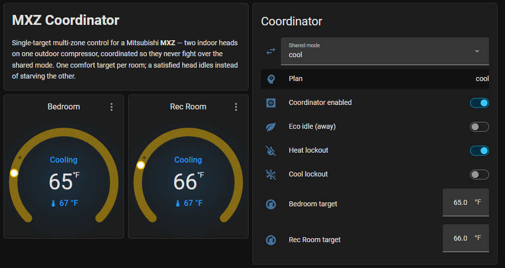
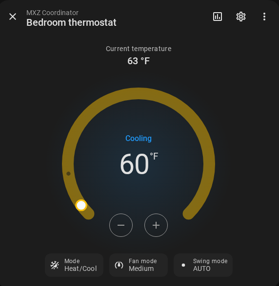
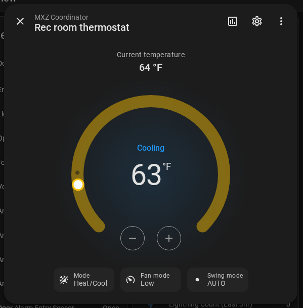
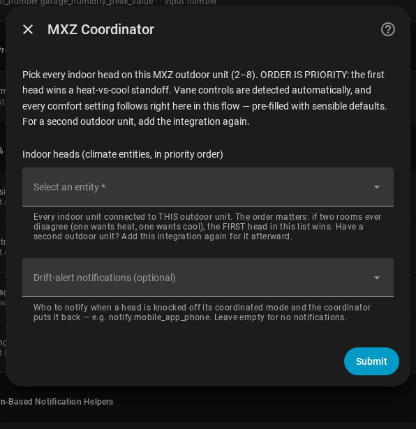
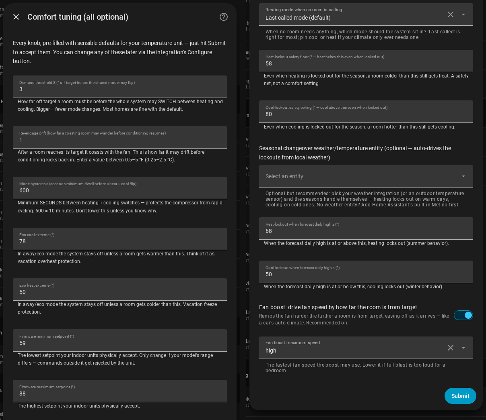

# MXZ Coordinator

**Set one temperature per room. The coordinator does the rest.**

The MXZ setups supported here put several indoor heads on one outdoor unit and use one
shared heating-or-cooling mode. In stock AUTO, rooms can conflict and one can wait in
standby. I saw it here: a room 6 °F too hot drew **26 W for over an hour** while a
satisfied head held the other mode. The coordinator ends that fight: set one number per
room, and it uses room sensors to choose one shared mode, fan, and priority. It cannot
provide simultaneous heat and cool, but it can keep a calling room from waiting behind a
satisfied one.



[](https://my.home-assistant.io/redirect/hacs_repository/?owner=dkpnw&repository=ha-mxz-coordinator&category=integration)
[](https://my.home-assistant.io/redirect/config_flow_start/?domain=mxz_coordinator)

**Install:** Add to HACS → Download → restart → Add Integration → pick your heads and one
temperature sensor per room. No YAML. [Details below.](#install)

> Shared as-is; support is best-effort ([Caveats](#caveats)). Built with AI assistance
> (Claude); every line reviewed, tested, and run in production on my own system.

**Works with compatible heads.** Built and validated against
[echavet/MitsubishiCN105ESPHome](https://github.com/echavet/MitsubishiCN105ESPHome), the
open-source ESP32/CN105 firmware for Mitsubishi heads. Your Home Assistant `climate`
entity must advertise both `heat` and `cool`. The idle choice must also match every selected
head: `fan_only` needs `fan_only`, `off` needs `off`, and the coil-dry choice needs both.
Setup lists only common idle choices and asks you to choose when the usual `fan_only`
default is unavailable. Fan and vane controls need those matching features. Kumo Cloud
and MELCloud are not validated here, and their features and behavior can differ. One
requirement: **a temperature sensor entity per room**. Pick one that Home Assistant keeps
available and current. A head's internal sensor can be selected. On my setup, it read
several degrees warmer than the occupied room while idle; other models and placements can
differ ([why that matters](#best-practice-give-the-firmware-your-room-sensor-too)).

---

## The problem: stock AUTO starves rooms

For the cited [MSZ-FH25VE/FH35VE/FH50VE indoor units, PDF page 7](https://library.mitsubishielectric.co.uk/pdf/download_full/56),
COOL/DRY/FAN and HEAT cannot run at the same time when several indoor units share one
outdoor unit. AUTO selects from that indoor unit's room temperature and setpoint, and
changes mode only after a sustained difference. The manual warns that a unit may be
unable to switch between COOL and HEAT and enter standby. That is a model-specific
changeover conflict, not one room governing every system or a mode-master wiring rule.

Basic AUTO is not the only manufacturer option. The [kumo cloud® 2.22 technician manual,
pages 15–17](https://www.mitsubishitechinfo.ca/sites/default/files/TM_Kumo_Cloud_2.22_ver.13_FINAL-2-20250917.pdf)
documents optional changeover groups for some MXZ systems, including zone priorities,
maximum standby, and minimum run time. That is a relevant alternative where its supported
hardware and setup apply; it is not tested for parity with this integration.

I observed this on my own system. A room 6 °F past its cooling target drew **~26 W for
over an hour** while the other head was satisfied. After I turned that head off, the room
ramped to ~460 W and cooled. This is a household observation, not a controlled comparison
or a measured energy, comfort, noise, or equipment-life result.

The same scenario, coordinated — both rooms served within minutes instead of an hour of
starvation:

```
elapsed    draw       what's happening
0:20       675 W      hot room cooling hard; satisfied room idle in fan_only
1:20–3:40   45 W      compressor anti-short-cycle pause (~2.5 min — normal)
4:00–6:20  101→609 W  both rooms served, sustained
```

**The coordinator applies three software rules:**

1. **Never hardware AUTO.** Every head runs one explicit shared mode — `cool` or `heat` —
   chosen from your real room temperatures against your targets.
2. **A satisfied room steps aside.** By default it commands `fan_only`; `off` and a
   cooling-only coil-dry option are available. These are software commands; their hardware
   boundary is explained in
   [How a satisfied head idles](#how-a-satisfied-head-idles).
3. **When rooms disagree, your priority wins.** The room you ranked first gets its mode.
   The other coasts until the system is free.

---

## What you get over the stock logic

### Comfort
- **One number per room.** Not a dual heat/cool band — one target, like a Tesla, and the
  coordinator picks the mode. Change it from HA, HomeKit, Google, or Assist.
- **Runs to your number, then coasts.** A room conditions until it *reaches* the target —
  not "close enough". Then it rests, and resumes only after it drifts past an adjustable
  drift band (0.5–5 °F / 0.25–2.5 °C). A satisfied room is never dragged along by its
  neighbor.
- **Per-room tolerance, automatable.** Every room has its own drift number — how far it
  may wander before conditioning resumes. Write it from a presence automation: tight
  while the room is in use, wide while it's empty. Tightening re-engages at once, so the
  room snaps back the moment someone walks in. A wide room also gives up its vote on the
  shared mode inside its own band. Touch nothing and every room follows the global
  drift, exactly as before. (Asked for, and shaped, by @amosyuen — #18.)
- **And a way back.** A room that has its own drift keeps it — even if you retype
  today's global number, which stores a copy that stops tracking the global. Press that
  room's **Follow global drift** button to drop the override. The room follows the global
  band live again, and keeps following when you change it. Its drift number republishes at
  once, then the button requests the ordinary debounced recompute. Applying the global band
  can change that room's demand, the shared mode and the head, just as typing a new global
  value would. The target, room enable, fan hold and every lockout stay put. If you disable
  or remove the room's drift number, the button stays unavailable because that number owns
  the saved override.
- **A fan that responds to need.** The firmware's own auto ramp is conservative on my
  heads. On heads with the coordinator's `auto` token and fan ladder, Fan boost (on by
  default) runs the fan harder the farther the room is from target and eases
  off as the room arrives — the way a Tesla's auto climate does — with hysteresis, so it
  never chatters. Max speed configurable.
- **Room sensors, not head sensors.** On my setup, a head's internal reading was several
  degrees warmer than the occupied room while idle. The coordinator trusts the sensor you
  place where people actually sit; other models and placements can differ.
- **Resting-mode bias.** When no room is calling, the system settles into the last mode
  used (default) — or pin it to cool or heat for one-sided climates.
- **Choose how a satisfied head idles.** By default it circulates in `fan_only`. If you
  notice a musty smell while it idles, try **Off after a coil-dry period**: the fan runs
  for a set period after cooling, then the head powers off. Choose `off` to power it off
  at once. The odor pattern does not establish its cause. Details:
  [How a satisfied head idles](#how-a-satisfied-head-idles).

<p align="center">
  
  
</p>
<sub>Fan dynamics live: the bedroom (3° out) at <b>Medium</b> while the rec room (1° out) has eased to <b>Low</b>.</sub>

### Control that stays yours
- **Pick a fan speed and it stays picked.** On a head that advertises fan control and an
  `auto` handback, set any speed by hand and the coordinator
  stops driving that fan — no snapping back to auto, no timeout. Each room has a
  **Fan auto** switch that shows who is driving and hands control back with one tap,
  including from Apple Home. Details: [Who drives the fan](#who-drives-the-fan).
- **Per-room enable switches.** Turn one room off without touching the others.
- **Pick the shared mode yourself.** **Shared mode** offers `cool` and `heat` — the two
  directions one outdoor unit can share. Choosing the other direction is a request for
  it, arbitrated the same way as an automatic flip: it stamps the ordinary mode-flip
  dwell, and automatic arbitration is free again once that dwell elapses. Choosing the
  direction already showing changes nothing — the dwell clock stays where it was, so a
  repeat choice buys no fresh dwell and creates no hold. The selector adds no expiry,
  renewal or time-based release of its own. It picks the direction and nothing else: it
  never starts the coordinator, wakes a disabled room, or lifts a lockout, the eco band,
  a standby hold, or a setpoint clamp. To stop the coordinator use the kill-switch below;
  to park the heads use the standby hold.
- **Away/eco mode.** One switch parks every head off unless a room crosses wide
  protection extremes (default 78/50 °F).
- **Grid-down / load-shed standby.** Watch any entity — a grid-status sensor, a
  load-shed switch, a vacation toggle — and while it's active every head parks in a
  low-power hold: `eco` uses the configured protection thresholds by default, or choose
  `off` / `fan_only`.
  It's a separate gate from the kill-switch — nothing to snapshot, nothing to restore —
  and coordination resumes on its own when it clears. A watched entity that drops out
  reads as *not* held, so a stuck sensor never parks your house. (Designed and built by
  @calvindomenico, #12/#13.) This is software protection only: keep the equipment's own
  freeze safeguards and do not treat it as certified unattended freeze protection.
- **One-switch kill.** Flip the coordinator off and your heads are instantly yours again,
  frozen where they were.
- **Vane control on the tile**, plus a **vane kick**: change a louvre while the head is
  off and the coordinator briefly wakes it, sends the change, then returns it to its
  parked state.

### Seasons & weather
- **Local-weather changeover.** Point it at any `weather.*` entity or outdoor temperature
  sensor. It locks out heating in the warm season and cooling in the cold one, from *your*
  forecast, with a band so shoulder seasons don't flap. No weather entity? HA's built-in
  Met.no is one click.
- **Passive-solar heat lockout.** A slightly-cool room can wait for the sun. A safety
  floor still requests heat for a genuinely cold room. This changes demand policy; it is
  not a measured energy-saving claim.
- **Cool lockout** — the winter mirror, with a safety ceiling for genuinely hot days.

### It doesn't break, and it tells the truth
- **Self-healing.** A head knocked off plan — wall remote, curious guest — is put back
  after a 20–30 s debounce. Optional phone alert when that happens.
- **Restart-proof.** Every target, drift, enable, mode, switch — and supported fan hold — survives
  an HA restart. A **Fan auto** switch keeps its entity identity if its head loads late and
  stays unavailable until that head reports the `auto` handback again. It still remembers
  whether you were holding, so a hold comes back as your hold and the boost's own speed comes
  back as the boost's. One honest edge:
  a fan speed set from a wall remote *while HA itself was down*, on a room that wasn't
  held before, can be read as the boost's own residue and cleared.
- **Invalid room sensors step aside.** A missing, `unknown`, `unavailable`, non-numeric,
  non-finite, or unsupported-unit reading fails to *neutral* before normal or eco demand.
  A sensor with no unit is read in your HA unit, as before. The room parks by your idle
  choice — `off` while eco is holding it — and its tile reads unknown, never a made-up
  number. Healthy rooms keep running, and a valid reading recovers by itself. This
  validates the current reading. Its age is the next bullet, and that check is optional.
- **A stale room sensor steps aside too — once you say what stale means.** Tell a room how
  often its sensor reports (`report_interval`, in minutes) and what makes one of that
  sensor's writes a reading (`evidence_basis`). Three reporting intervals with no reading
  and the room leaves automatic demand, its head parks by your idle choice, and the log
  says so once. One fresh reading brings the room back, and the log says that once too.
  Under `ha_state_write` an unchanged value still counts as a reading, so a room sitting at
  temperature is not mistaken for a dead sensor; under `sample_timestamp` only a write
  whose marker advanced counts, so a cached value written again is not one.
- **A cadence alone never starts a cutoff.** `evidence_basis` is `unknown` until you set
  it, so a room you say nothing about — and a room you gave only an interval — shows its
  age and is never cut off. Choose `ha_state_write` when the source guarantees every write
  is a current reading, or `sample_timestamp` when it publishes the time or sequence
  number of the sample itself. A cloud integration that re-writes a cached value keeps its
  room healthy under the first choice and goes stale on the device's own clock under the
  second. There is no default cutoff to inherit, and no setup screen collects these yet —
  they are written into the room's entry data or options
  ([details](docs/MIGRATION.md#stale-room-sensors-unreleased)).
- **A stale room keeps its last real reading** — no substitute value, no switch to another
  sensor — and a fan speed you are holding is left alone. After a restart or a reload,
  health starts over from what the integration can see. A room whose sensor already
  carries a valid reading and a sample time inside its maximum age starts `healthy` on
  that time, because the sample dates itself. Every other room with a valid reading starts
  as `awaiting_report`: used, but flagged, for one grace period, because a sequence number
  found there is only a baseline, and a plain value cannot be told from a restored one.
  The first reading it does watch ends that grace on the spot. A room with no usable
  reading gets no grace: it is rejected at once, as at any other time.
- **If HA itself goes down**, the heads keep their last commanded state and their own
  control loops keep running — a cooling room keeps cooling on the head's thermistor. A
  room parked in `fan_only` (or `off`, if you chose that idle action) stays parked until
  HA returns; the
  [remote-sensor timeout](#best-practice-give-the-firmware-your-room-sensor-too) keeps
  the head's own loop on honest data meanwhile.
- **Mode-flip protection.** A 10-minute minimum limits rapid changes of the shared mode.
  Every setpoint is clamped to the firmware's real range before sending. Writes happen
  only when something must change.
- **Durable config.** Options saves merge instead of replace, and settings are mirrored,
  so a corrupted save self-recovers instead of resetting to defaults.
- **A transparent brain.** The plan sensor exposes every decision input live — per-room
  demand, who is coasting, who holds the fan, the standoff state, whether a standby hold
  is active. "Why did it do that?" always has an answer.
- **The tile shows real airflow** while the fan is in auto, if your firmware publishes
  blower speed — see [Who drives the fan](#who-drives-the-fan).

### Fit & finish
- **One-click install.** HACS + config flow; every option visible at setup, pre-filled
  with sensible defaults.
- **°C and °F, automatically** — adapts to your HA unit, with 0.5° resolution and clean
  metric defaults on °C.
- **Native HomeKit / Google / Assist tiles** — one clean dial per room, never a raw
  dual-setpoint firmware control.
- **2–8 rooms per outdoor unit**, plus multiple outdoor units, one entry each — see
  [N zones](#n-zones-v3).
- **Automation-friendly.** A `recompute` service, an event hook, and every threshold
  tunable in the UI.

---

## How it works

The coordinator is the **sole writer** of the heads. Three parts (Python in
`custom_components/mxz_coordinator/`; the legacy
[`packages/mxz_coordinator.yaml`](packages/mxz_coordinator.yaml) implements the same three
parts for two fixed zones, and doesn't track newer features):

1. **Decide** — `sensor.*_plan`, side-effect-free. A room must be 3 °F off target
   (default) before the shared mode may flip — or past its own drift band, if you set
   that wider. The highest-priority room wins standoffs, and a 600-second hysteresis
   gates every flip. A running room goes all the way to its target, then coasts in
   `fan_only` — or parks `off`, if you chose that idle action — until it drifts past
   its re-engage band (default 1 °F, settable per room). Away/eco swaps both
   thresholds for the wide protection extremes.
2. **Act** — the only component that commands heads. It derives each room's setpoints
   from its single target (`cool → [target−2, target]`, `heat → [target, target+2]`;
   the band is 1° on °C systems), clamps to the firmware range (default 59–88 °F /
   15–31 °C), and sends them with the mode — or a single clamped target for
   single-setpoint firmware. Never `heat_cool`.
   Idempotent, and gated on the kill-switch. A head that rejects a command degrades only
   its own room; the rest keep running.
3. **Trigger** — recompute on any decision-relevant change, a 15-minute heartbeat, HA
   start, the moment a flip the hysteresis deferred is due, and the `mxz_recompute`
   event — plus the two self-heal paths.

Every threshold is an option default. Change them at setup or later under **Configure**.
On a metric system the defaults adapt (1.5° demand, 0.5° re-engage, 21 °C target,
20/10 °C changeover), and all sensors and setpoints read and write in your HA unit.

### Who drives the fan

Simple rules, no surprises:

- **Boost drives by default.** While a room runs, its fan speed follows how far the room
  is from target. When the room is satisfied, the fan returns to the firmware's `auto`.
- **Your pick is a hold.** Choose any speed — HA, Apple Home, the wall remote — and the
  coordinator stops writing that fan. The hold survives the head cycling off, and it
  never times out. Each room reports its hold as `fan_hold` on the plan sensor.
- **Hand it back with one gesture.** Flip the room's **Fan auto** switch ON, or set the
  fan to `auto`. Nothing else releases a hold — not room drift, not a target change, not
  a restart. (The switch exists because Apple's Home app cannot show a custom control
  inside a climate tile, and its fan slider has no `auto` stop — so the handback rides
  beside the tile as a plain switch. It also doubles as the who-is-driving indicator:
  OFF means a hold is active.)
- **Capability changes do not rename it.** The **Fan auto** entity stays registered through
  a restart or a temporary loss of head capabilities. It is unavailable while the head does
  not advertise fan control with the exact `auto` token, and returns under the same entity ID
  when that support returns.
- **Restarts are honest.** The **Fan auto** switch remembers across restarts whether you
  were holding. Held stays held — at whatever speed the head actually shows, so a change
  made from the wall remote during the outage is respected. Not held means any leftover
  speed is the coordinator's own, and it resumes driving.
- **The dial tells the truth.** If the firmware publishes its real blower speed
  (CN105/ESPHome heads expose a `stage` sensor — auto-detected at setup), the tile
  tracks real airflow while the fan is in auto, instead of freezing on the last
  commanded speed. Display only; the reading maps the firmware's stages to the nearest
  speed. No such sensor? The tile shows the commanded speed, as before.
- **One limit.** The coordinator reads fan state once per cycle, not per event.
  Re-selecting the speed a head already shows is invisible. Pick a different speed first
  if you want a fresh gesture registered.
- **Mitsubishi trap, handled.** The real fan ladder is
  `quiet < low < medium < middle < high` — `middle` is *faster* than `medium`. The
  coordinator knows, and skips any rung your unit does not advertise. The thermostat facade
  does not rename other integrations' fan options: it exposes their exact settable names.

### How a satisfied head idles

`fan_only` idle keeps the indoor fan moving. On my heads, idle air smelled off and the
smell stopped while the coil was actively cooling. That pattern does not diagnose its
cause; it is why the **Idle action** option (Configure → options) offers three parks:

| Setting | A satisfied head... |
| --- | --- |
| `Fan only` (default) | circulates in `fan_only`. Unchanged from earlier versions. |
| `Off` | powers off. The fan stops. |
| `Off after a coil-dry period` | keeps its fan running for a set period after **cooling** (default 10 min, tunable), then powers off. After heating it powers off at once. |

Facts to know before you switch:

- **What `off` does not prove.** The idle choice commands airflow and power; it is not a
  refrigerant-seal setting. For the MXZ-4C36NAHZ, 5C42NAHZ, 8C48NAHZ, 8C48NA, and 8C60NA
  families covered by [OCH573E, PDF page 126](https://www.mitsubishitechinfo.ca/sites/default/files/SH_MXZ-%284%29%285%29%288%29C%2836%29%2842%29%2848%29%2860%29NA%28HZ%29_PAC-MKA%2830%29%2831%29%2850%29%2851%29BC_OCH573E_1.pdf),
  Mitsubishi documents SW5-8 as a countermeasure against room-temperature rise in parked
  indoor units. Enabling it before power-on fully closes the indoor electronic expansion
  valve in FAN, COOL, STOP, or thermo-OFF. The same row warns that refrigerant can collect
  in thermo-OFF units, reducing capacity and raising discharge temperature. This supports
  a model-specific explanation for why a parked room can warm in heating season. It does
  not show whether SW5-8 is enabled, prove the actual valve position, or measure the
  temperature effect in your installation.
- **The room's thermostat tile still reads *Idle*, not *Off*.** The room is enabled and
  coordinated; only the head is parked. It wakes the moment the room drifts past its
  re-engage band.
- **Fan holds survive.** A head parked off keeps a manual fan hold and comes back
  holding it. On the way into an `off` park the coordinator first returns a
  boost-driven fan to `auto` — so a restart never mistakes the boost's leftover speed
  for your hold.
- **Vane changes still work.** Changing a louvre on a parked-off head briefly wakes it
  (the usual [vane kick](#control-that-stays-yours)), then parks it again.
- **Standoff losers park the same way.** A room waiting for the other mode idles in
  the same configured action as a satisfied room.

---

## Install

1. **[Add to HACS](https://my.home-assistant.io/redirect/hacs_repository/?owner=dkpnw&repository=ha-mxz-coordinator&category=integration)**
   → **Download**. (If the badge doesn't open: add this repo as a HACS custom repository,
   category *Integration*.)
2. **Restart Home Assistant.**
3. **[Add Integration](https://my.home-assistant.io/redirect/config_flow_start/?domain=mxz_coordinator)**
   → *MXZ Coordinator*.
4. Pick **all the heads on this outdoor unit** (2–8). Selection order is priority: the
   first room wins standoffs. Name the outdoor unit here if you run more than one, and
   pick an optional notify target for drift alerts. Setup checks that every head
   advertises heat and cool. It rejects and names any head stored by another coordinator
   entry. An unfinished setup or reconfigure flow also reserves its submitted heads until
   HA finishes or cancels that flow. HA keeps an interrupted flow in memory without a
   timeout. Flow-manager cancellation releases it; otherwise restart HA before retrying.
5. **Name each room.** Every box arrives pre-filled with the head's own name, so you can
   submit this step unchanged. The name labels that room's target, drift, enable switch,
   Fan auto and thermostat. Two rooms may not share a name, and a room may not be left
   unnamed.
6. Pick one **room temperature sensor** per room. The picker lists `sensor` entities with
   device class *temperature*. Vane and airflow sensors are detected automatically. Setup
   refuses a sensor two rooms share, a sensor Home Assistant has no state for, and a
   sensor reporting a unit it cannot convert to yours. A sensor that is only unavailable
   or not reporting a number does not block the install — the summary marks that room
   instead, and the room makes no automatic demand until a valid number arrives.
7. **Read the summary and press Save and finish.** Nothing is written until you do. The
   summary lists each room's priority, name, head and current sensor reading, and says
   what happens after the save. **Change advanced settings** opens the comfort tunables,
   pre-filled for your temperature unit, and returns to the summary; skipping it saves
   exactly those defaults. That step lists only idle actions every selected head can
   perform, and if the normal `fan_only` default is unsupported, Save and finish sends
   you there to choose explicitly instead of saving something a head cannot do.
8. Turn on **Coordinator enable**, set each room's target, enable the rooms. Done.
9. Exposing to HomeKit or Google? Expose the per-room **thermostat tiles**
   (`climate.*_<zone>_thermostat`), **not the raw heads** — two controls per room would
   fight over the same hardware. [Details.](#the-single-target-thermostat-surface)

<p align="center">
  
</p>
<p align="center">
  
</p>

Example day/night/away presets: [`examples/presets.yaml`](examples/presets.yaml).

**No HACS?** The original YAML package still ships
([`packages/mxz_coordinator.yaml`](packages/mxz_coordinator.yaml) +
[`docs/ENTITY-MAP.md`](docs/ENTITY-MAP.md)). Migrating from it to the integration is a
breaking change — see [`docs/MIGRATION.md`](docs/MIGRATION.md), and remove the package so
the two don't fight over the heads.

### Reconfiguring

Picked the wrong sensor, or adding a head? Don't delete and re-add — use
**Settings → Devices & Services → MXZ Coordinator → ⋮ → Reconfigure**. It walks the same
screens as setup — heads, room names, sensors, then a summary — pre-filled with what the
entry already stores, and writes nothing until you press **Save and finish**. Comfort
settings are not editable here; use **Configure** for those. Every head you keep takes its name, vane
wiring (including your overrides), target, enable, drift and fan hold with it, wherever
you move it in the list — reordering changes priority and nothing else. Dropped rooms'
entities are cleaned up automatically. Reconfigure rejects a head newly taken from another
entry. Existing installs that already overlap are grandfathered only for heads already
stored by the entry being edited: you can keep or remove those heads, but you cannot add
another entry's head or expand the overlap. The integration does not remap or disable
either entry automatically. (Delete-and-re-add has its own trap: HA's restore cache
can resurrect the old install's values for up to ~7 days. The coordinator detects and
ignores those stale restores.)

Reconfigure also checks the entry's saved idle action against every submitted head. If a
head cannot perform it, the form names that head and lists the common alternatives; it does
not change the entry. Change **Idle action** explicitly under Configure, or choose a
compatible head, then retry. An older entry with an incompatible stored choice is likewise
left unchanged until you make that choice.

Configure also stops before the idle selector when a stored head has not loaded or the heads
have no common parking mode. It names the affected heads and tells you to restore their
capabilities or reconfigure them. Your saved options and defaults stay unchanged while you fix
the heads and retry. You cannot save other tunables in Configure until the configured
heads resolve.

**Renaming a room.** Edit **Room N name** on Reconfigure's room-names step. The new
name appears on that room's target, drift, Follow global drift button, enable switch, Fan
auto and room thermostat.
Clear the field to fall back to the head's own name. Renaming the head itself still
changes nothing. An entity you renamed by hand keeps your name (**Settings → Devices &
Services → MXZ Coordinator →** the entity **→ ⚙**) — your name outranks the room's. Entity
IDs never move once created, so history and dashboards keep working.

### Removing

Delete the **config entry**, not the device: **Settings → Devices & Services →
MXZ Coordinator → ⋮ → Delete**. That removes the device, its entities, and the
`recompute` service cleanly — no restart needed. (The device page has no Delete button by
design: the device *is* the config entry, and its **Visit** link brings you here.) Then
remove the download from HACS — **in that order**; removing from HACS first leaves a
broken entry behind.

Your heads keep their last commanded state after removal. If they were parked `off` or
`fan_only`, set them how you want them via their own controls.

---

## Best practice: give the firmware your room sensor too

The coordinator reads your room sensors, but each head's own control loop still runs on
its internal thermistor. On my setup, that reading was several degrees warmer than the
occupied room while idle; other models and placements can differ. Feed the SAME room
sensor to the firmware so both layers use one reading. On CN105/ESPHome that is a
`homeassistant` sensor bound via `remote_temperature_source`:

```yaml
sensor:
  - platform: homeassistant
    id: remote_temp_ha
    entity_id: sensor.your_room_temperature   # the same sensor you give the coordinator
    filters:
      - lambda: return (x - 32) * (5.0/9.0);  # only if your HA runs °F
      - clamp:                                # the firmware accepts 1–40 °C
          min_value: 1
          max_value: 40
          ignore_out_of_range: true

climate:
  - platform: cn105
    # ...
    remote_temperature_source:
      sensor_id: remote_temp_ha
    remote_temperature_timeout: 30min
    remote_temperature_keepalive_interval: 20s
```

The timeout is the safety: if the sensor drops out, the head falls back to its internal
reading instead of holding a stale number.

## Gotchas (read before you debug)

- **Per-zone power is shared, not per-head.** Only the lowest-address head reports the
  real outdoor-unit draw; the others read near-zero even while actively served. Never
  declare a head dead from its own power sensor.
- **Anti-short-cycle timing.** ~3 minutes minimum compressor off-time in cooling; ~6
  minutes to engage after a cool→heat reversal. `hvac_action` flips instantly; the power
  draw lags. Normal.
- **`fan_only` is a configured parking state**, not by itself a fault. It is the default
  software action for a satisfied or waiting room; `off` is also available. See
  [How a satisfied head idles](#how-a-satisfied-head-idles) for the hardware boundary.
- **Respect the setpoint clamp.** Below-range setpoints made `climate.set_temperature`
  throw HTTP 500 on our heads — hence the clamp. Adjust it to your firmware's range.
- **Minimum-capacity floor.** On my setup, power did not fall below roughly 40% of
  nameplate while running. Mild overshoot alone does not diagnose a deadlock.
- **Fan stuck at one speed?** That is a manual hold, not a bug — someone picked that
  speed, so the coordinator stopped driving the fan (the room's **Fan auto** switch reads
  OFF; `fan_hold` on the plan sensor agrees). Flip the switch back ON — or set the fan to
  `auto`. See [Who drives the fan](#who-drives-the-fan).
- **Musty smell from an idle head?** Check the plan sensor and the head first. If both show
  your configured idle action, the smell alone is not evidence that the coordinator chose
  the wrong state. On my system it stopped during active cooling and returned at idle.
  Try **Off after a coil-dry period** (Configure → options), then compare; that tests a
  practical response, not the cause. See
  [How a satisfied head idles](#how-a-satisfied-head-idles). Have a persistent sweet or
  chemical smell checked rather than attributing it to idle airflow.

---

## N zones (v3)

v3 coordinates **2–8 heads on one outdoor unit** — selection order is standoff priority,
every room gets its own target/enable/thermostat, and existing 2-zone installs migrate
automatically with no entity changes. Multiple outdoor units: one entry each, with its own
mode, hysteresis, changeover, and kill-switch. Validated on real 2-zone and 3-zone hardware
through the beta program
([issue #4](https://github.com/dkpnw/ha-mxz-coordinator/issues/4)); 6-zone and 2×3-zone
systems run it in the field. Simultaneous heat+cool and branch-box VRF are out of scope.

## Caveats

- Built on one real two-zone setup (MSZ heads, dual-setpoint firmware) and validated on a
  second: a three-zone system with single-setpoint heads, through the full v3 beta program
  ([#4](https://github.com/dkpnw/ha-mxz-coordinator/issues/4) — thanks @helicopterrun).
  Other models/firmware may still differ — especially the cool→heat reversal lag and the
  per-zone power blindness.
- The coordinator is validated against the CN105/ESPHome setup above. Other HA `climate`
  entities need compatible modes and features, and remain unverified; the native
  single-target thermostats are optional on top.

## The single-target thermostat surface

Each room ships as a native thermostat (`climate.*_<zone>_thermostat`): one number +
Heat/Cool auto, rendered as a clean single-setpoint tile in HA/HomeKit/Google. It is a
thin facade over the room's `number.*_<zone>_target` and `switch.*_<zone>_enable` — the
coordinator remains the sole writer of the real heads. Expose these tiles (not the raw
heads) to avoid two fighting controls per room; fan and vanes pass through, bounded to
the firmware band.

Legacy note: the YAML package got this surface from the CN105 proxy's
`coordinator_single_target` option. The integration no longer needs the proxy — its
native thermostats own the surface, and the `mxz_recompute` event is still honored so
existing proxy/automation nudges keep working.

## Credits & prior art

- [@helicopterrun](https://github.com/helicopterrun) — 3-zone hardware validation and
  relentless, root-caused QA through the v3 beta (#5, #6, #7).
- [@andrewblane](https://github.com/andrewblane) — caught on a 6-zone system that the
  first two zones ignored their own names, and sent the fix (#8); caught a parked room's
  tile reporting heating/cooling during a standoff, and sent that fix too (#16).
- [@calvindomenico](https://github.com/calvindomenico) — caught a ducted air handler's
  phantom vane and sent the fix (#9), root-caused a rejected setpoint on °C-native heads
  down to the rounding step (#10), then the standby hold: proposed, designed, and built
  (#12, #13).
- [@amosyuen](https://github.com/amosyuen) — caught that the room tile dropped
  `hvac_mode` from `climate.set_temperature`, with the root cause and the exact code
  pointer (#17); asked for per-room drift and shaped its presence-tier design (#18);
  caught the entry filing itself under Helpers instead of Integrations (#19).
- [BarrettPalmer/Smart-HVAC-Automation-for-Home-Assistant-Mini-Splits](https://github.com/BarrettPalmer/Smart-HVAC-Automation-for-Home-Assistant-Mini-Splits)
- [bjrnptrsn/climate_group_helper](https://github.com/bjrnptrsn/climate_group_helper)
- [bartmachielsen/smart_climate](https://github.com/bartmachielsen/smart_climate)
- [Mitsubishi Electric FH operating instructions](https://library.mitsubishielectric.co.uk/pdf/download_full/56),
  [kumo cloud® 2.22 technician manual](https://www.mitsubishitechinfo.ca/sites/default/files/TM_Kumo_Cloud_2.22_ver.13_FINAL-2-20250917.pdf),
  and [OCH573E service manual](https://www.mitsubishitechinfo.ca/sites/default/files/SH_MXZ-%284%29%285%29%288%29C%2836%29%2842%29%2848%29%2860%29NA%28HZ%29_PAC-MKA%2830%29%2831%29%2850%29%2851%29BC_OCH573E_1.pdf)
  for the scoped AUTO, changeover, and LEV references above.

## License

[MIT](LICENSE).

---

*Not affiliated with, endorsed by, or associated with Mitsubishi Electric Corporation.
"Mitsubishi Electric" and the three-diamond logo are trademarks of their respective owner,
used here for identification/compatibility only.*
