# MXZ Coordinator

**Set one temperature per room. The coordinator chooses one shared heating or cooling mode.**

Several indoor heads share one MXZ outdoor unit. When rooms disagree, stock AUTO can
leave one waiting in standby. MXZ Coordinator uses your room sensors, targets and
priority order to choose an explicit shared mode. A satisfied room steps aside. It
cannot heat one room and cool another at the same time.

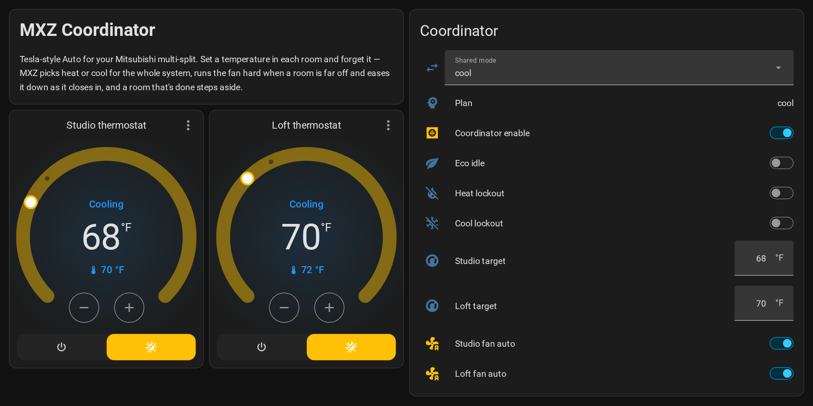

[](https://my.home-assistant.io/redirect/hacs_repository/?owner=dkpnw&repository=ha-mxz-coordinator&category=integration)
[](https://my.home-assistant.io/redirect/config_flow_start/?domain=mxz_coordinator)

**Start here:** [Install](#install), then [set up your outdoor unit](#set-up-your-outdoor-unit).
Use [Reconfigure](#reconfigure-heads-rooms-and-sensors) to change the room list and
[Configure](#configure-comfort-and-sensor-settings) to tune it. No YAML is required.

This checkout prepares **3.4.0**. Its setup, sensor, room-lifecycle and command-delivery
changes are described in [Migration](docs/MIGRATION.md#upgrading-to-340).
Final release validation remains pending. The setup, Reconfigure and Configure screenshots
below are 3.4.0 captures from Home Assistant 2026.10.0 with invented heads and sensors.
The dashboard image shows an earlier release.

> Shared as-is; support is best-effort. Automated checks use invented heads and sensors.
> They establish software behavior, not physical performance on your equipment.

## Before you install

Use Home Assistant **2024.12.0 or newer**. Select **2–8 heads on one outdoor unit**;
add a separate coordinator entry for each outdoor unit. Each selected `climate` entity
must advertise `heat`, `cool` and a common idle action. `fan_only` needs `fan_only`;
`off` needs `off`; `off_after_dry` needs both. Fan control also needs the advertised
fan-mode feature. **Fan auto** requires the exact `auto` token.

Choose a separate temperature `sensor` entity for each room. The picker uses device
class **temperature**. A head's temperature sensor can be selected. On my installation
it read warmer than the occupied room while idle; placement and firmware can differ.

Built against [echavet/MitsubishiCN105ESPHome](https://github.com/echavet/MitsubishiCN105ESPHome).
Earlier releases have field experience on two- and three-zone hardware, with six-zone
and multiple-outdoor-unit reports. Other climate integrations, including Kumo Cloud
and MELCloud, remain unvalidated here. Compatible advertised features alone do not
prove equivalent timing or hardware behavior. Simultaneous heat/cool and branch-box
VRF are outside this integration's scope.

## The problem: stock AUTO starves rooms

For the cited [MSZ-FH25VE/FH35VE/FH50VE indoor units, PDF page 7](https://library.mitsubishielectric.co.uk/pdf/download_full/56),
COOL/DRY/FAN and HEAT cannot run at the same time when several indoor units share one
outdoor unit. AUTO selects from that indoor unit's room temperature and setpoint, and
changes mode only after a sustained difference. The manual warns that a unit may be
unable to switch between COOL and HEAT and enter standby. That is a model-specific
changeover conflict, not one room governing every system or a mode-master wiring rule.

Basic AUTO is not the only manufacturer option. The [kumo cloud® 2.22 technician manual,
pages 15–17](https://www.mitsubishitechinfo.ca/sites/default/files/TM_Kumo_Cloud_2.22_ver.13_FINAL-2-20250917.pdf)
documents optional changeover groups for some MXZ systems, including zone priorities,
maximum standby, and minimum run time. That is a relevant alternative where its supported
hardware and setup apply; it is not tested for parity with this integration.

I observed this on my own system. A room 6 °F past its cooling target drew **~26 W for
over an hour** while the other head was satisfied. After I turned that head off, the room
ramped to ~460 W and cooled. This is a household observation, not a controlled comparison
or a measured energy, comfort, noise, or equipment-life result.

The same scenario, coordinated — both rooms served within minutes instead of an hour of
starvation:

```
elapsed    draw       what's happening
0:20       675 W      hot room cooling hard; satisfied room idle in fan_only
1:20–3:40   45 W      compressor anti-short-cycle pause (~2.5 min — normal)
4:00–6:20  101→609 W  both rooms served, sustained
```

**The coordinator applies three software rules:**

1. **Choose an explicit direction.** MXZ requests `cool` or `heat` for rooms that need
   conditioning, using room temperatures and targets. It does not request hardware AUTO.
2. **A satisfied room steps aside.** By default it commands `fan_only`; `off` and a
   cooling-only coil-dry option are available. These are software commands; their hardware
   boundary is explained in
   [How a satisfied head idles](#how-a-satisfied-head-idles).
3. **Resolve disagreement by priority.** Among rooms voting for opposing modes, the
   higher-priority room wins, subject to mode dwell and lockouts. The other waits.

---

## Install

1. [Add this repository to HACS](https://my.home-assistant.io/redirect/hacs_repository/?owner=dkpnw&repository=ha-mxz-coordinator&category=integration)
   and select **Download**. If the link does not open, add
   `https://github.com/dkpnw/ha-mxz-coordinator` as a custom repository of type **Integration**.
2. Restart Home Assistant to load the integration.
3. Open **Settings → Devices & services → Add integration → MXZ Coordinator**.
4. Complete the setup below. Installation alone does not enable control.

Without HACS, copy the release's `custom_components/mxz_coordinator` directory into
Home Assistant's `custom_components` directory, restart, then add the integration.
The shipped [YAML package](packages/mxz_coordinator.yaml) is a separate legacy option.
To move from it, follow [Migration](docs/MIGRATION.md#moving-from-the-yaml-package).
Stop its automations before letting the integration control the same heads.

## Set up your outdoor unit

Setup has four steps. Only **Save and finish** creates the entry.

1. **Heads.** Select every head on this outdoor unit once, in priority order.
   Position 1 wins a heat-versus-cool standoff. Give the outdoor unit an optional
   name and choose an optional drift-alert notification service. The outdoor-unit
   name labels the entry; it does not form entity IDs.
2. **Rooms.** Check each pre-filled **Room N name**. Use distinct, non-empty names;
   comparison ignores case. These names label the room entities.
3. **Room temperature sensors.** Pick one sensor per room. Check the room/head
   mapping and the displayed reading. Vane and airflow entities are detected from
   the head's device when matching registry records exist. Missing records or no
   matching device leave those optional controls unset; edit them later in Configure.
4. **Check this before you save.** Read each priority, head and sensor line.
   Select **Change advanced settings** to tune comfort, then return to the summary.
   Select **Go back to heads and rooms** to correct the mapping.
   Select **Save and finish** when it is right.

The screenshots in this README come from Home Assistant 2026.10.0 in its dark theme,
with invented heads (Studio, Loft, Den, Nook) and invented sensors.

<table>
<tr>
<td width="50%">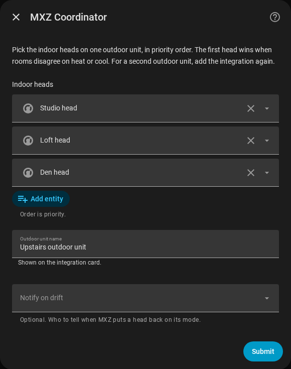</td>
<td width="50%">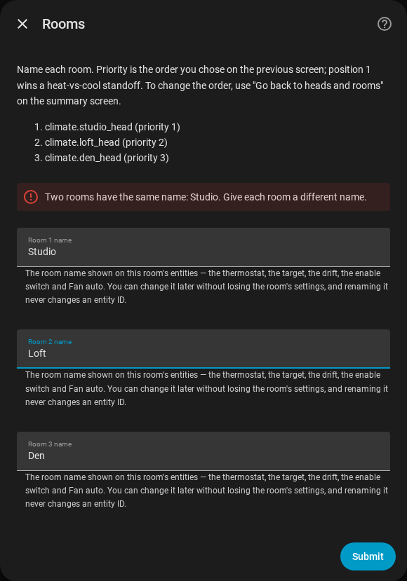</td>
</tr>
<tr>
<td>1. Heads: three heads in priority order and an outdoor-unit name.</td>
<td>2. Rooms: the names are corrected to Studio, Loft and Den. The error above them is from the previous submit, which had two Studios.</td>
</tr>
<tr>
<td>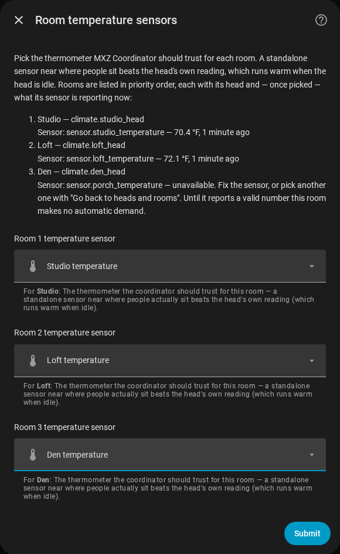</td>
<td>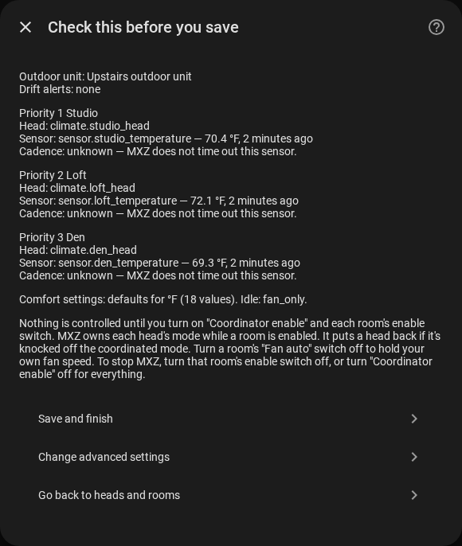</td>
</tr>
<tr>
<td>3. Sensors: the list shows the last submitted sensor and reading for each room. Den's earlier, unavailable porch sensor is still listed; Den temperature is picked but not yet submitted.</td>
<td>4. Summary: each room's priority, head, sensor, reading and cadence, then the three choices.</td>
</tr>
</table>

Skipping advanced settings uses defaults for your HA temperature unit. If the selected heads
cannot all use the usual `fan_only` idle action, setup sends you to advanced settings to
choose a supported alternative. It does not silently replace that default.

<details>
<summary>Setup's advanced step: Comfort tuning (all optional)</summary>

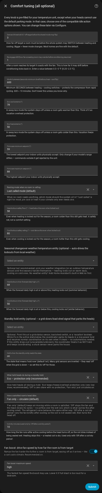

The full form opened by **Change advanced settings**, pre-filled with °F defaults.
Submitting it returns to the summary.
</details>

After **Save and finish**, Home Assistant shows its own device **Name and assign** step.

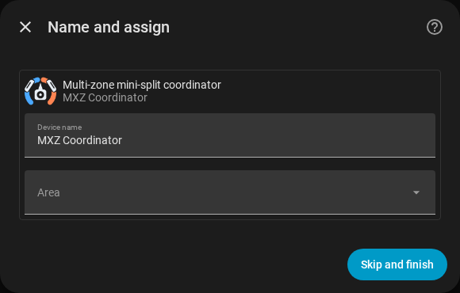

After saving, open the integration's device page. Set the room targets, enable the
rooms you want to coordinate, then turn on **Coordinator enable**. New room enables
and Coordinator enable start off. Expose the per-room thermostats to HomeKit/Google,
or use them in HA; avoid exposing a second raw-head control for the same room.

### If setup stops or warns

| What you see | What to do; what MXZ saves |
| --- | --- |
| A missing head or unknown capabilities | Let the head integration load and publish its modes. Unknown support blocks saving. |
| A head lacks heat/cool, or there is no common idle action | Choose compatible heads. Setup does not invent a mode. |
| A head belongs to another entry | Reconfigure that entry first. Setup names the conflict and saves nothing. |
| A head is reserved by an open flow | Finish or cancel that setup/Reconfigure flow. Reservations have no timeout; HA restart clears an abandoned in-memory flow. |
| Duplicate heads or room names, or an empty room name | Correct the selection/name. Setup keeps you on that step. |
| Two rooms share a sensor, a sensor has no HA state, or its unit cannot convert | Pick a distinct, existing temperature sensor with a supported unit. Saving is blocked. |
| A sensor is `unknown`, `unavailable`, non-numeric or non-finite | You may finish setup. The summary warns; that room makes no automatic demand until its reading is valid. |
| A sensor's unit attribute is absent or `null` | MXZ reads it in HA's system unit. Verify that interpretation. Celsius, Fahrenheit and kelvin convert to the system unit. An empty string (`""`), another unsupported string or a non-string unit is invalid and blocks saving. |

<details>
<summary>Screenshots of setup errors and warnings</summary>

<table>
<tr>
<td width="50%">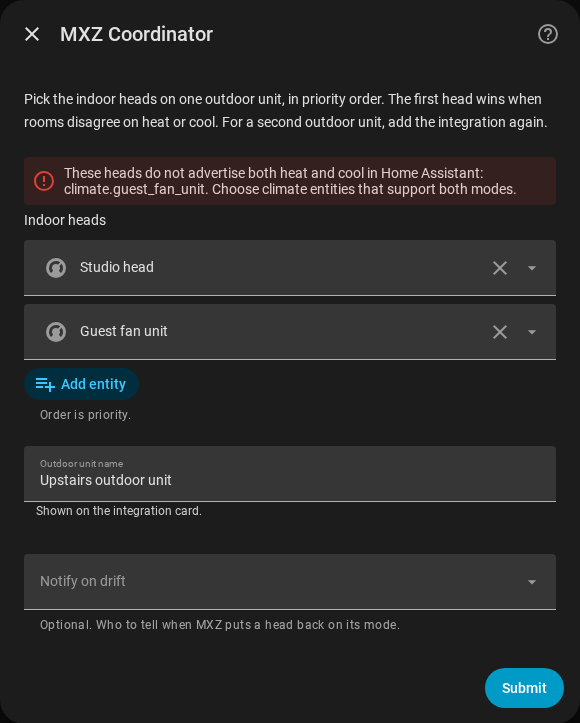</td>
<td width="50%">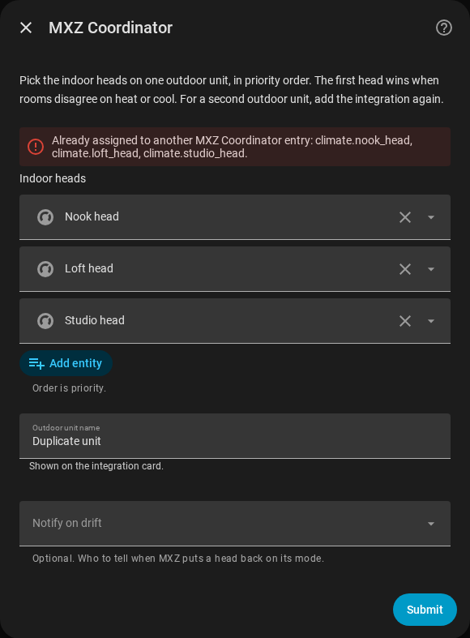</td>
</tr>
<tr>
<td>A fan-only guest unit is rejected because it lacks heat and cool.</td>
<td>The heads belong to another entry. The error names them, and the heads step stays open.</td>
</tr>
<tr>
<td>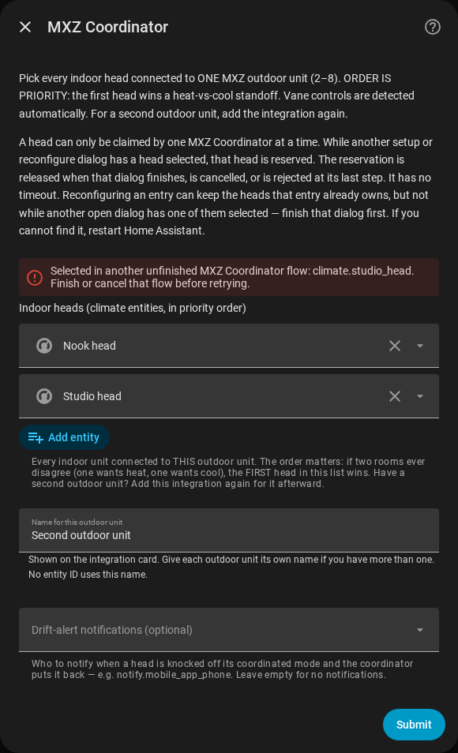</td>
<td>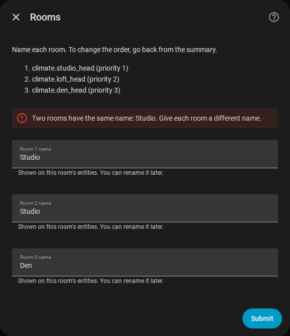</td>
</tr>
<tr>
<td>A head is reserved by another open setup dialog.</td>
<td>Two rooms have the same name.</td>
</tr>
<tr>
<td>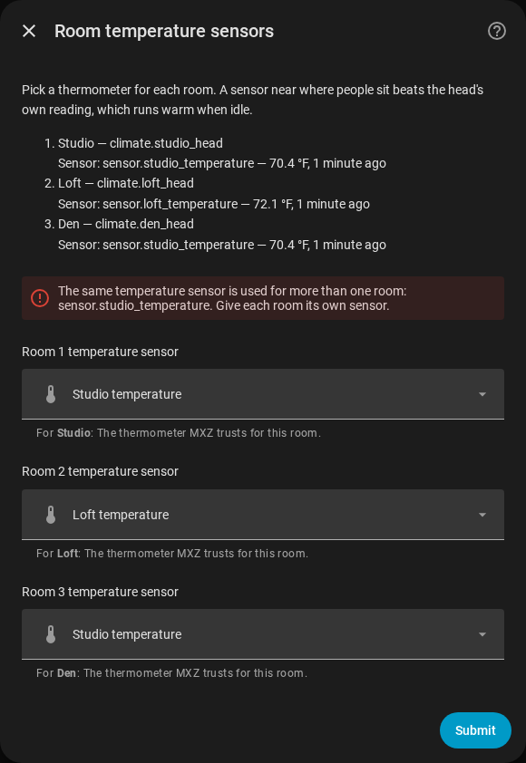</td>
<td>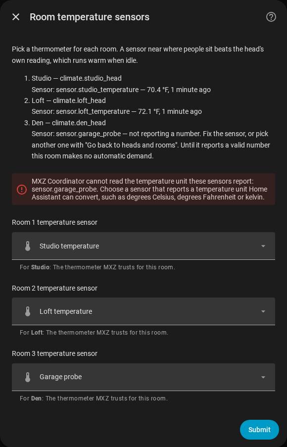</td>
</tr>
<tr>
<td>One sensor picked for two rooms is blocked.</td>
<td>A sensor whose unit cannot be converted is blocked.</td>
</tr>
<tr>
<td>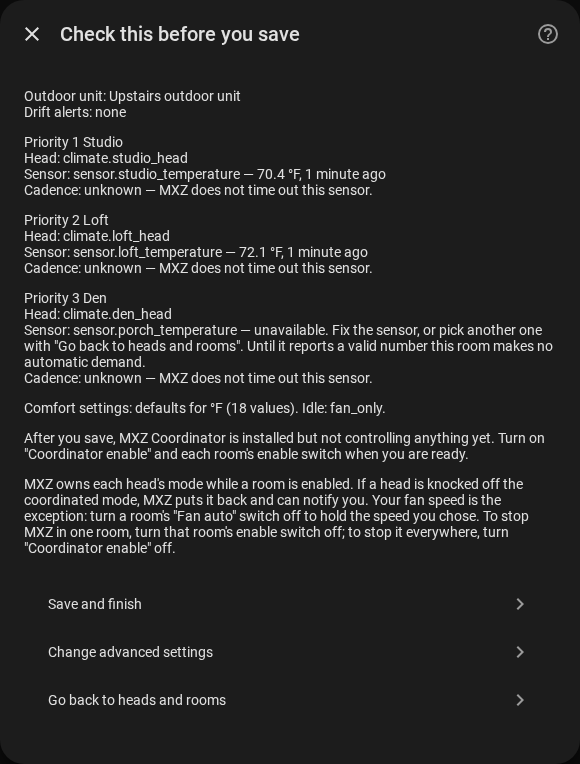</td>
<td></td>
</tr>
<tr>
<td>An unavailable sensor is accepted. The summary warns that the room makes no automatic demand until it reads a valid number.</td>
<td></td>
</tr>
</table>
</details>

The summary's reporting age is information. Setup adds no sensor timeout. Heads,
ownership, sensors and the chosen idle action are checked again at the final save;
a change while the summary is open can send you back to correct it.

## Reconfigure heads, rooms and sensors

Open **Settings → Devices & services → MXZ Coordinator → ⋮ → Reconfigure**.
Use this to add/remove heads, change priority, rename rooms, change sensors, or change
the outdoor-unit title and drift-alert service. It follows heads → rooms → sensors →
summary, pre-filled from the entry. Select **Save and finish** to apply it.
Comfort and sensor-freshness settings stay in Configure.

<table>
<tr>
<td width="50%">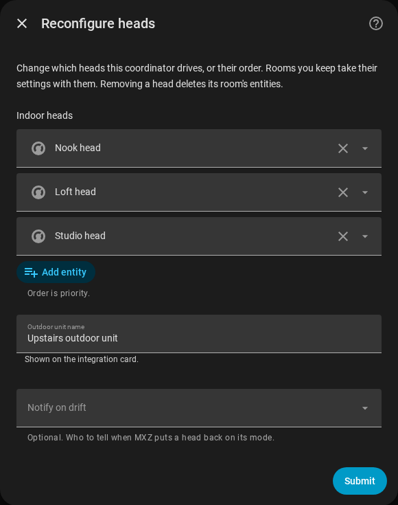</td>
<td width="50%">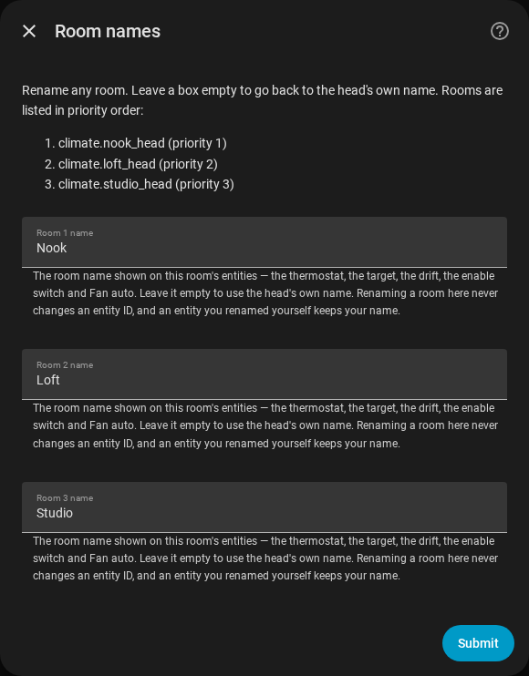</td>
</tr>
<tr>
<td>Heads: Nook added at priority 1, Loft kept at 2, Studio moved from 1 to 3, Den dropped.</td>
<td>Room names in the new priority order. An empty box uses the head's own name.</td>
</tr>
<tr>
<td>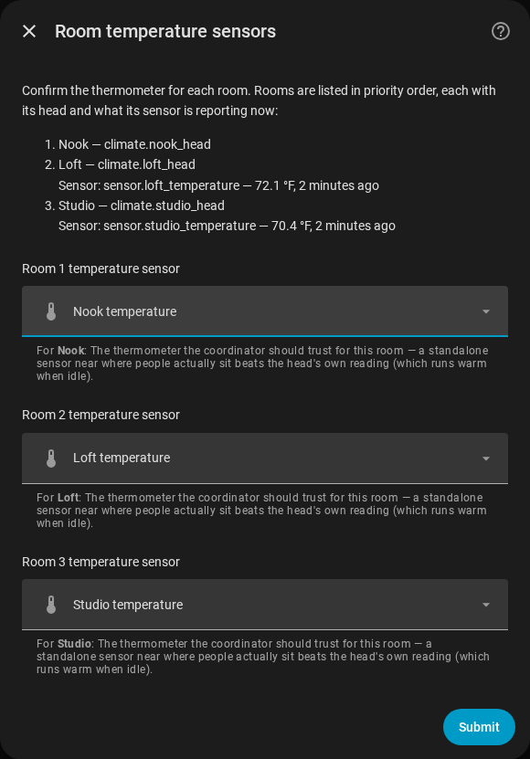</td>
<td>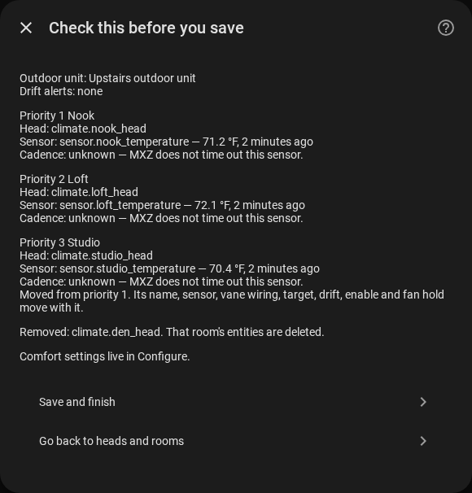</td>
</tr>
<tr>
<td>Sensors: kept rooms show their current sensors; Nook temperature is picked for the new room.</td>
<td>Summary: Studio's move, its saved freshness profile, Den's removal and the reload note. Only <b>Save and finish</b> and <b>Go back to heads and rooms</b> are offered.</td>
</tr>
</table>

For a kept head, submitted room names and sensors replace the old ones. Vane wiring
and other stored room fields are retained. Reordering moves existing registry records
with their room, preserving entity IDs, restored target/enable/drift/fan-hold settings
and registry customizations. Their slot-derived unique IDs change to the new priority.
Plan attributes such as `primary_demand` and `zones[0]` follow priority, so check any
slot-based automation after a reorder. Missing or manually removed records cannot be
carried. A removed room's records are pruned on setup; a newly added room starts disabled.

Clear a room name to use the head's current name. Duplicate names are still rejected.
An entity name you set in HA takes precedence over the room label. Renaming a head
alone does not update a saved room name. A room rename does not change its entity ID.

Reconfigure checks the entry's saved idle action against the submitted heads. If it
is incompatible, change **Idle action** in Configure while the current heads still
support that choice, or select compatible heads and retry. Existing overlapping
entries may keep or remove heads they already stored; they cannot expand that overlap.
Another open flow can still reserve those heads. MXZ does not repair or disable the
other entry for you.

A save that changes entry data, title or identity triggers one reload. A save that
leaves them unchanged triggers none. Reload
rebuilds the coordinator and restarts sensor-health observation. Reconfigure finishes
by closing the flow after a successful save with MXZ's own completion text.

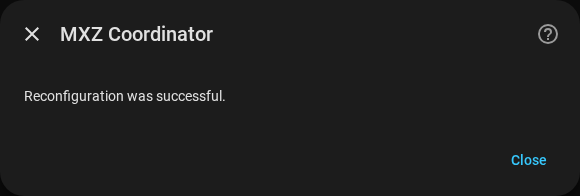


## Configure comfort and sensor settings

Open **Settings → Devices & services → MXZ Coordinator → Configure**.
The single form contains comfort settings, per-room vane/airflow overrides and freshness
profiles. Change the values, then submit. Temperature fields use your HA unit; mode
dwell is in seconds, coil drying and freshness durations are in minutes.

<details>
<summary>Screenshots of the full Configure form, top to bottom</summary>

<table>
<tr>
<td width="50%">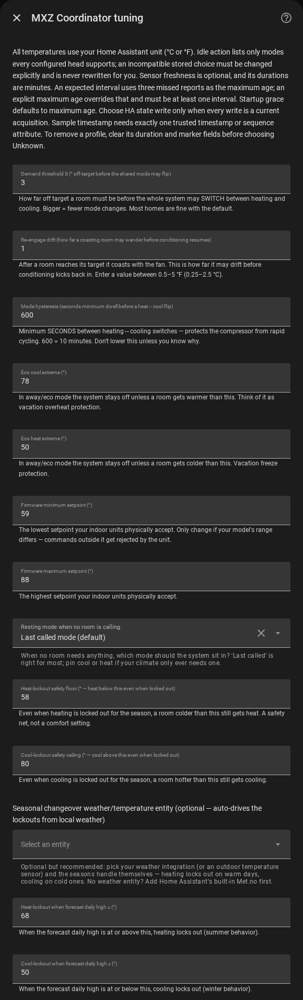</td>
<td width="50%">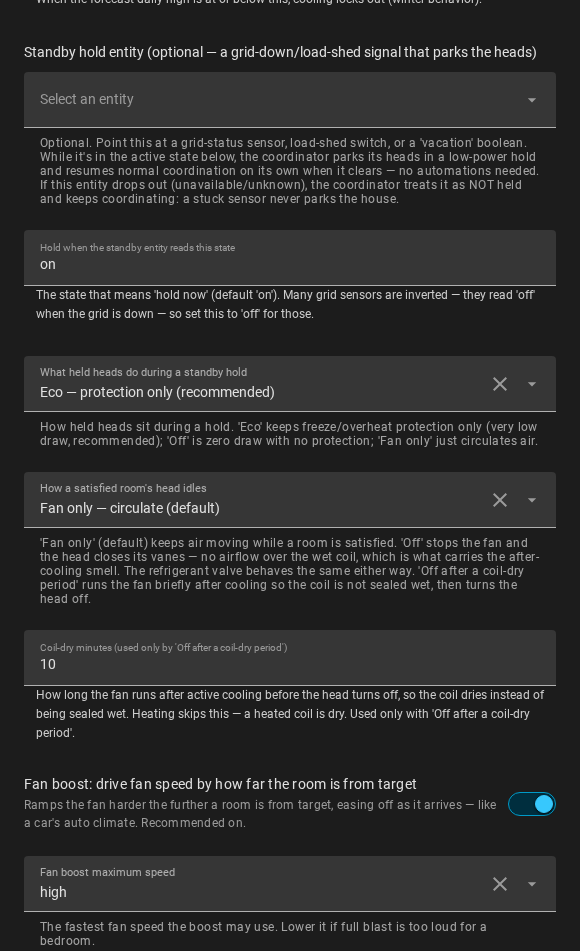</td>
</tr>
<tr>
<td>Comfort, setpoint range, resting mode, lockouts and seasonal changeover.</td>
<td>Standby hold, idle action, coil drying and fan boost.</td>
</tr>
<tr>
<td>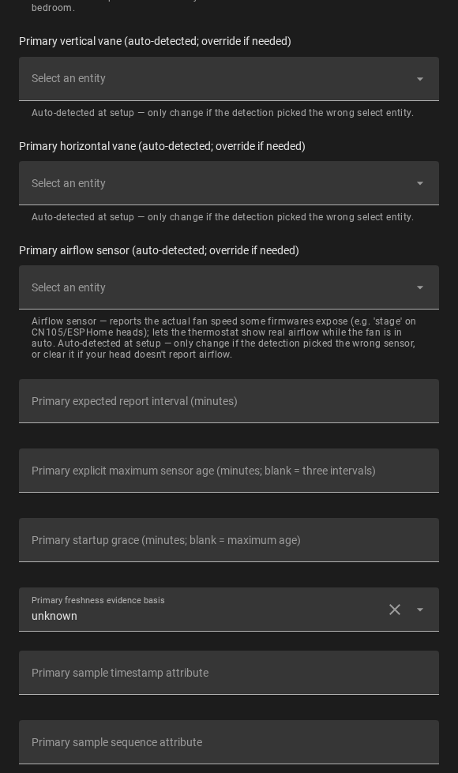</td>
<td>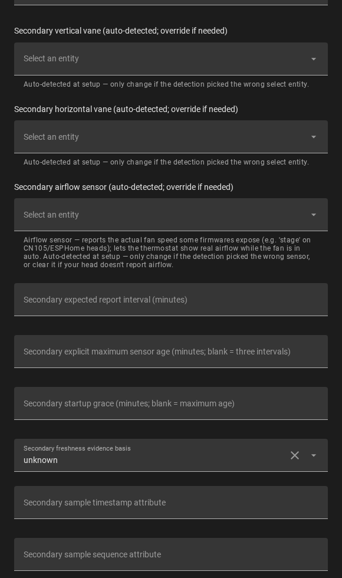</td>
</tr>
<tr>
<td>Priority 1 room, labeled Primary: vanes, airflow and all six freshness fields.</td>
<td>Priority 2 room, labeled Secondary: the same fields.</td>
</tr>
<tr>
<td>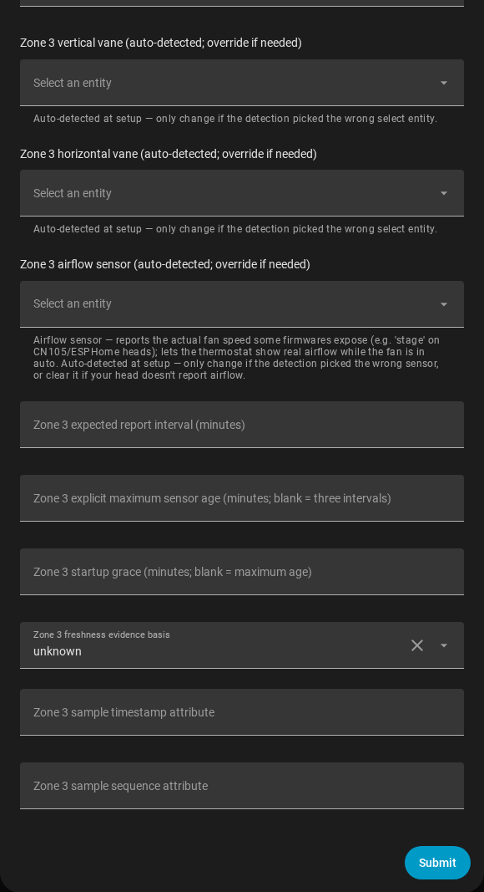</td>
<td></td>
</tr>
<tr>
<td>Priority 3 room, labeled Zone 3, then Submit. The form labels these fields by priority, not room name.</td>
<td></td>
</tr>
</table>
</details>

| Setting | Use it for |
| --- | --- |
| Demand threshold / Re-engage drift | Shared-mode voting and how far a satisfied room drifts before calling again. Per-room drift numbers can override the global drift. |
| Mode hysteresis | Minimum dwell between shared heat/cool changes; default 600 seconds. |
| Firmware minimum/maximum setpoint | The head's allowed range. Commands are also bounded by usable head limits. |
| Idle action / Coil-dry minutes | Fan-only, off, or fan-only after cooling for a dwell then off. Choices depend on common head support. |
| Resting mode | Last called mode, cool or heat when no room is calling. |
| Fan boost / Fan boost maximum speed | Automatic fan ladder and its ceiling. A manual hold takes precedence. |
| Eco cool/heat extremes | Protection thresholds used by eco and the default standby hold. Keep the equipment's own safeguards. |
| Seasonal changeover and lockout thresholds | Weather/outdoor-temperature input and seasonal heat/cool lockouts, with safety floor/ceiling. |
| Standby hold entity / active state / action | An external signal that holds enabled coordination in `eco`, `off` or `fan_only`. Missing/unknown/unavailable input releases the hold. |
| Room vane and airflow overrides | Correct detection, select another entity, or clear a field to remove that optional wiring. |

A head with no HA state or unknown `hvac_modes`, a head missing either `heat` or `cool`,
or heads with no common parking mode block the whole form's save. Restore the head
integration's capability reports or use Reconfigure to select compatible heads, then
reopen Configure. An `unavailable` head that still reports the required capabilities
can pass this check; availability alone does not determine it. An unsupported saved
idle action requires an explicit compatible choice.

All numeric comfort temperatures, thresholds and durations must be finite numbers:
`nan` and `±inf` are rejected. Demand threshold S, Re-engage drift, Mode hysteresis
and Coil-dry minutes cannot be negative. Zero is allowed for demand and the two
durations; Re-engage drift also has its selector's 0.5–5 °F / 0.25–2.5 °C bounds.
Negative Celsius temperatures are legitimate in temperature fields. The paired rules are:

| Configure labels (in HA's temperature unit) | Accepted order |
| --- | --- |
| Eco heat extreme / Eco cool extreme | Heat ≤ cool; equality is allowed. |
| Firmware minimum setpoint / Firmware maximum setpoint | Minimum ≤ maximum; equality is allowed. |
| Heat-lockout safety floor / Cool-lockout safety ceiling | Floor ≤ ceiling; equality is allowed. |
| Cool-lockout when forecast daily high ≤ / Heat-lockout when forecast daily high ≥ | Cool threshold < heat threshold; equality is rejected to retain a shoulder band. |

Values saved by 3.3.0 are not silently rewritten on upgrade. If they violate these
rules, submitting Configure, even to change another setting, is refused until you
repair the highlighted values. For a pair error, inspect both fields and correct
their order; for “Enter a finite number” or “This value cannot be negative”, replace
that value. Review the complete form and submit again. A threshold or freshness error
rejects the whole submission: none of its other edits is saved. Freshness durations
have their separate positive-minute rules below.

<table>
<tr>
<td width="33%">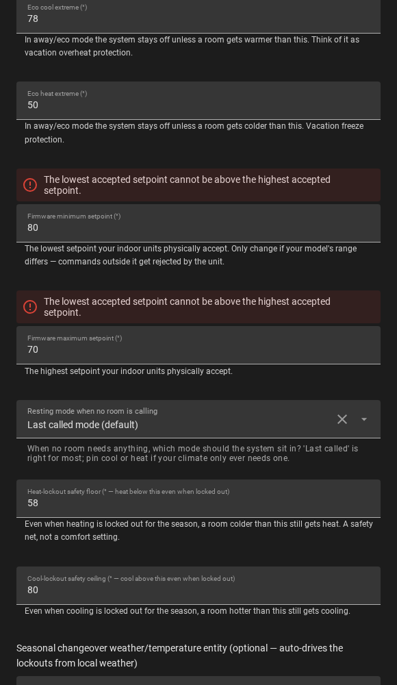</td>
<td width="33%">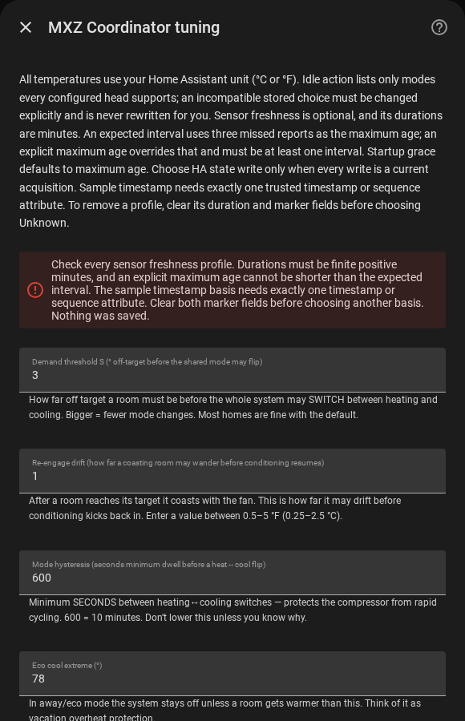</td>
<td width="33%"></td>
</tr>
<tr>
<td>A minimum setpoint above the maximum marks both fields.</td>
<td>An invalid freshness profile rejects the form: “Nothing was saved.”</td>
<td>A later valid submission saves.</td>
</tr>
</table>

A changed save merges tunables into existing options, mirrors them into entry data,
and reloads once. It does not replace the options with only the edited field. A save that leaves entry
data/options unchanged needs no reload. The data mirror can recover tuned values
when options are empty, but does not prove how they became empty. Review and save
Configure if that warning appears. Cleared vane/airflow fields remove their overrides;
a cleared standby entity explicitly removes that hold. Do not infer that every
optional field has the same clearing behavior.

### Choose a sensor freshness contract

Leave the profile empty if you cannot establish a reporting contract. MXZ shows
`cadence_unknown`, displays age and applies no age cutoff. Giving only an interval,
or keeping `evidence_basis: unknown`, does not make a sensor trustworthy.

To enable age checking, supply a positive **report interval** or **maximum age**, then
choose an evidence basis. With only an interval the maximum is three intervals. An
explicit maximum must be at least the interval. Startup grace defaults to that maximum.

| Evidence basis | Choose it when |
| --- | --- |
| `ha_state_write` | The source guarantees each HA write is a current reading, even when its numeric value is unchanged. Cached/restored replays can defeat this basis. |
| `sample_timestamp` | The source supplies a trustworthy advancing sample marker. Enter exactly one timestamp or sequence attribute. Timestamps need a timezone and cannot be in the future; sequences must increase. |
| `unknown` | No reliable reporting contract exists. Clear durations and marker fields to remove the profile. |

An invalid reading steps aside immediately. A valid but stale room leaves automatic
demand and parks by the configured idle action (`off` under eco), while its recognized
manual fan hold stays intact. Its tile keeps the valid reading; age/health in the plan
explain why it is no longer calling. A qualifying fresh report recovers the room.
A cached marker does not extend a deadline or recover an unhealthy room.

Reload/restart does not persist health. A valid recent sample timestamp can start
healthy. Other valid profiled readings start `awaiting_report` for one grace period;
a sequence found at load is only a baseline. An unusable reading gets no grace.
See [Migration](docs/MIGRATION.md#stale-room-sensors-340) for deadline and recovery edges.

## Everyday control

Use each room's thermostat for one target and `heat_cool`/`off`. Here `heat_cool` means
the coordinator chooses a shared direction; it does not send hardware AUTO or heat/cool
simultaneously. Turning the tile off disables that room. Disabling a room relinquishes
its coordination; it does not promise to power the raw head off.

The coordinator commands mode and bounded setpoints for enabled rooms. Rooms run to
target, then coast until their drift band is crossed. The defaults are 3 °F demand,
1 °F drift, or 1.5 °C demand and 0.5 °C drift. A fresh target uses the head's
setpoint when readable; 70 °F / 21 °C is the fallback. Each room's drift number
accepts 0.5–5 °F / 0.25–2.5 °C. Writing it creates an override, even if you enter today's
global value. Press **Follow global drift** to remove that override. The number updates
immediately; the ordinary debounced recompute can then change demand and head output.
The button is unavailable until its drift number is loaded and available.

After restart, MXZ can resume an observed `cool`/`heat` run when both Coordinator enable
and that room's enable restore ON. It waits for usable head evidence and a valid room
reading that is not stale under an enforced freshness profile. Construction and a live
enable do not adopt a previous run. Changing a target while the coordinator is OFF
or the room is disabled clears that run's latch; when
enabled again, the room starts coasting and uses the ordinary re-engage band. This
fixes the restart intent that 3.3.0's construction-time compute could spend too early.
After a room coasts, a follow-up refresh lets it progress without needing a head echo.

**Shared mode** offers `cool` and `heat`. A changed choice stamps the ordinary mode-flip
dwell; automatic arbitration can change direction again after that dwell. Selecting
the current direction adds no hold or new dwell. The selector does not enable the
coordinator, enable rooms or lift lockouts/standby holds.

Turn **Coordinator enable** off to stop new coordinated control and use the heads'
own controls. Heads keep their last commanded state. A handler already accepted by
another integration can return late; turning MXZ off cannot retract it. A standby hold
instead parks coordinated heads for as long as its signal is active. Its default `eco`
action allows conditioning at protection extremes; `off`/`fan_only` are fixed parks.
These are software policies, not certified freeze protection or guarantees of zero draw.

### Who drives the fan

Fan boost starts enabled. On compatible heads it follows the supported ladder
`quiet < low < medium < middle < high`, skipping absent rungs. A recognized manual
speed becomes a hold. **Fan auto** OFF requests a hold at the current speed; at `auto`
that action is a no-op. ON releases the hold, or set the head's fan to `auto`.
The hold has no timeout. Targets and room drift do not release it.

The room thermostat exposes the head's exact settable fan names. Without advertised
fan control it offers no fan control. The separate Fan auto switch stays registered
but is unavailable without exact `auto` support, or after a coordinator update failure.
If support exists but current speed is missing, intent is retained and fan writes wait
for a usable report. An explicit ON can remain pending; OFF cancels that handback.
Manual fan picks on the room thermostat queue behind the current service call to that
same head; a hung handler can delay the pick. Other heads can progress concurrently.

A stored hold restores as held; stored automatic ownership recognizes supported
coordinator residue, including the issue 25 idle/delayed-report case. Clean switch
states and unavailable-state extra restore data are distinct restore channels.
Neither is a command journal or an arbitrary-crash guarantee. Missing, invalid or
stale restore records use conservative reported-speed fallback. A fresh install or newly
added room has no saved fan record, so nothing was lost and no fan-hold reason is shown.
A record that exists but cannot be used still explains itself in `control_reasons`: it
belongs to an older entry, or it is missing or malformed. Use ON when you want automatic
control back. With no reported speed, fallback still sends no fan write. A wall-remote
speed change while HA was down may be treated as residue if the room was previously
automatic. Reselecting
a speed already reported can be invisible; use Fan auto OFF to express a hold.

An optional airflow `stage` sensor maps the firmware's reported blower stage to a
displayed speed while automatic. It is display information, not physical verification
of a sent command. Without that sensor the tile uses the reported fan token.

The thermostat's fan feature follows the head's reported capabilities. HomeKit/Google
bridge behavior when those capabilities arrive after accessory creation is untested;
entity tests do not prove the fan control appears in the bridge without a reload.

## How a satisfied head idles

`fan_only` idle keeps the indoor fan moving. On my heads, idle air smelled off and the
smell stopped while the coil was actively cooling. That pattern does not diagnose its
cause; it is why the **Idle action** option (Configure) offers three parks:

| Setting | Requested idle action |
| --- | --- |
| `Fan only` (default) | circulates in `fan_only`. Unchanged from earlier versions. |
| `Off` | sends `off`, asking the head to stop. |
| `Off after a coil-dry period` | requests `fan_only` for a dwell after **cooling** (default 10 min), then `off`. After heating it requests `off` immediately. |

Facts to know before you switch:

- **What `off` does not prove.** The idle choice commands airflow and power; it is not a
  refrigerant-seal setting. For the MXZ-4C36NAHZ, 5C42NAHZ, 8C48NAHZ, 8C48NA, and 8C60NA
  families covered by [OCH573E, PDF page 126](https://www.mitsubishitechinfo.ca/sites/default/files/SH_MXZ-%284%29%285%29%288%29C%2836%29%2842%29%2848%29%2860%29NA%28HZ%29_PAC-MKA%2830%29%2831%29%2850%29%2851%29BC_OCH573E_1.pdf),
  Mitsubishi documents SW5-8 as a countermeasure against room-temperature rise in parked
  indoor units. Enabling it before power-on fully closes the indoor electronic expansion
  valve in FAN, COOL, STOP, or thermo-OFF. The same row warns that refrigerant can collect
  in thermo-OFF units, reducing capacity and raising discharge temperature. This supports
  a model-specific explanation for why a parked room can warm in heating season. It does
  not show whether SW5-8 is enabled, prove the actual valve position, or measure the
  temperature effect in your installation.
- **The room's thermostat tile still reads *Idle*, not *Off*.** The room is enabled and
  coordinated; only the head is parked. Crossing the re-engage band requests
  conditioning through the ordinary debounced delivery path.
- **Fan holds survive.** A head parked off keeps a manual fan hold and comes back
  holding it. On the way into an `off` park the coordinator first returns a
  boost-driven fan to `auto`. A delayed or missing report still needs the restore
  reconciliation and conservative fallback described above.
- **Vane changes still work.** Changing a louvre on a parked-off head briefly wakes it
  (the usual [vane kick](#everyday-control)), then parks it again.
- **Standoff losers park the same way.** A room waiting for the other mode idles in
  the same configured action as a satisfied room.

---

## Best practice: give the firmware your room sensor too

The coordinator reads your room sensors, but each head's own control loop still runs on
its internal thermistor. On my setup, that reading was several degrees warmer than the
occupied room while idle; other models and placements can differ. Feed the SAME room
sensor to the firmware so both layers use one reading. On CN105/ESPHome that is a
`homeassistant` sensor bound via `remote_temperature_source`:

```yaml
sensor:
  - platform: homeassistant
    id: remote_temp_ha
    entity_id: sensor.your_room_temperature   # the same sensor you give the coordinator
    filters:
      - lambda: return (x - 32) * (5.0/9.0);  # only if your HA runs °F
      - clamp:                                # the firmware accepts 1–40 °C
          min_value: 1
          max_value: 40
          ignore_out_of_range: true

climate:
  - platform: cn105
    # ...
    remote_temperature_source:
      sensor_id: remote_temp_ha
    remote_temperature_timeout: 30min
    remote_temperature_keepalive_interval: 20s
```

The timeout is the safety: if the sensor drops out, the head falls back to its internal
reading instead of holding a stale number.

## Diagnose a room that is waiting

Open `sensor.*_plan` on the device page. Start with the room's entry in `zones`, then
compare it with the raw head and room sensor. Top-level primary/secondary attributes
refer to priority slots, not permanent room identities.

| Observation | Meaning and next step |
| --- | --- |
| `standoff`, demand/engage, mode dwell | Another room's priority or dwell may be holding the direction. Check targets and priority before changing a raw head. |
| `inhibited`, room enable, lockouts, eco | A configured gate may be parking the room. Check the controlling switch/input. |
| `sensor_health`, `sensor_age`, `sensors_ok` | Check validity and the freshness contract. Age of an HA write can differ from age of a sample. |
| `fan_hold`, `control_reasons` | Check ownership, capability, restore and settings warnings with their suggested next step. |
| `command_status: pending`, `command_deferred` | A service handler has not returned. New intent waits for that head; independent rooms can continue. |
| `command_status: rejected` | Read `command_error` and repair the head integration. A later ordinary update may retry. |
| `command_status: returned` | The HA handler returned. This does not prove the hardware applied the command. |
| `cancelled; outcome unknown`, retired ownership | External work may still finish. Check the head's report before relying on its outcome. |

Command timestamps and `head_state_updated_at` are HA software observations. They do
not show physical receipt, compressor operation or energy use. A missing date reads
`not yet recorded`. A global update failure can make the plan and coordinator-listening
entities unavailable, even while heads remain registered. Room isolation covers
independent head delivery failures; it is not a guarantee against every coordinator,
core or transport failure. Reload/unload suppresses retired follow-on work, but cannot
undo an accepted external call. A vane kick on a parked head briefly wakes it, sends
the requested vane change and requests parking; software cleanup still needs hardware
confirmation.

The thermostat, Fan auto switch and plan's `zones` include added diagnostics listed in
[Entity map](docs/ENTITY-MAP.md#integration-diagnostic-surfaces-340). Delivery changes
publish immediately, even outside refresh completion. `head_state_updated_at` is only
on the plan's `zones`, as of the plan's last update; the head entity shows its own live
time. A head update the room thermostat does not display, such as the head's own
temperature reading, adds no thermostat `state_changed` event. Delivery progress, fan
state and reason changes still update these attributes, which can add recorder
history/storage and fire automations with a bare state trigger. Use an explicit state
transition or selected attribute when that is your automation's intent. Exact database
rows, bytes and hourly growth have not been measured.

Sensor refreshes already covered by a newer decision are coalesced by generation.
Pending delivery can prompt a follow-up outside the ordinary debounce; several requests
can collapse into that follow-up. There is no one-compute-per-sensor-write guarantee.

Heads use their own loops if HA goes down. A head last commanded cooling can continue
cooling; one last parked stays parked. Their thermistors and firmware safeguards still
matter. On my system compressor pauses and reversal lag outlast the HA mode report.
Absent fan settings use defaults; the plan names that absence without guessing
why. Invalid stored fan values also receive a diagnostic. Review Configure to set
supported values. A per-head power sensor alone may not report outdoor-unit draw. Check your equipment
before interpreting an idle report as a fault or an energy measurement.

Example presets: [day/night/away](examples/presets.yaml). The
`mxz_coordinator.recompute` service requests refreshes for loaded entries; the
`mxz_recompute` event is also honored. Neither bypasses safety gates or proves delivery.

## Remove the integration

Delete the entry through **Settings → Devices & services → MXZ Coordinator → ⋮ →
Delete**, then remove its download from HACS. Removing files first leaves a broken entry.
The shared recompute service is removed after the last loaded entry is gone. Heads
retain their last commanded state; use their controls if they remain parked. Prefer
Reconfigure to delete/re-add when correcting a room: old HA restore-cache values can
linger, and MXZ filters records from before the new entry's creation.

## Developer setup and tested support

The declared HA floor is 2024.12.0. Retained local full-suite evidence exists for these
exact targets on the accepted product implementation; final 3.4.0 source/version and
release validation remain pending. Automated entities are invented. Current rendered
forms and physical behavior are separate evidence requirements.

| Python | Home Assistant | Dependency setup |
| --- | --- | --- |
| 3.12.14 | 2024.12.0 | `requirements/constraints-py312-ha2024.12.0.txt` |
| 3.13.16 | 2026.2.3 | `requirements/constraints-py313-ha2026.2.3.txt` |
| 3.14.8 | 2026.9.0 | `requirements/constraints-py314-ha2026.9.0.txt` |
| 3.14.8 | 2026.10.0 | [Exact generated stable test environment](requirements/ha2026.10/README.md) |

The first three locks belong to the existing CI lanes. The .10 recipe uses public
immutable core/plugin inputs, a pinned Python archive and actual locally built artifact
hashes. Public plugin `0.13.370` requires beta4; installing it by version alone does
not reproduce the stable .10 environment. Use the linked recipe on Linux x86-64 with
glibc 2.41 or newer. Its local evidence does not establish genuine hosted qualification.

For a small local floor environment, use a new work directory outside the checkout
and an installed Python 3.12.14. This command is for your development machine; it does
not impersonate GitHub runner context or run the CI-only installer.

```bash
work="$HOME/mxz-floor-work"
mkdir -p "$work/home" "$work/tmp" "$work/cache"
export HOME="$work/home" TMPDIR="$work/tmp" XDG_CACHE_HOME="$work/cache"
export PYTHONDONTWRITEBYTECODE=1 PIP_CONFIG_FILE=/dev/null
export PIP_NO_CACHE_DIR=1 PIP_DISABLE_PIP_VERSION_CHECK=1
unset PIP_INDEX_URL PIP_EXTRA_INDEX_URL PIP_TRUSTED_HOST PYTHONPATH
python3.12 -m venv "$work/venv"
"$work/venv/bin/python" -m pip install --index-url https://pypi.org/simple \
  -c requirements/constraints-py312-ha2024.12.0.txt \
  -r requirements/constraints-py312-ha2024.12.0.txt -r requirements_test.txt
"$work/venv/bin/python" -m pip check
"$work/venv/bin/python" tools/check_lock.py \
  requirements/constraints-py312-ha2024.12.0.txt \
  0d0031ddca8bb870560ca4d4bcafd34233e23e9dd6f0470dc31f7bd888eb7403 3.12.14
"$work/venv/bin/python" -m pytest -p tools.pytest_phases tests/ -q -s -p no:cacheprovider
"$work/venv/bin/ruff" check --no-cache custom_components/ tests/ tools/
```

Use the floor when your platform cannot run the exact .10 bundle, and label the result
with its actual floor versions. It does not validate .10. Do not disable ordinary HA
plugin loading, replace failed phases with collection, or infer hardware results from
mock entities. Restore uses normal `RestoreEntity` state/extra data; flow schemas use
Voluptuous. MXZ raises its own `reconfigure_successful` and `already_configured` aborts
without HA's central translation domain (the floor has no such parameter), so both
strings ship locally in `strings.json`/`translations/en.json`; tests resolve every flow
reason through HA's translation loader on each lane. On HA 2026.10.0 (frontend
20260930.2) the real frontend rendered the local text, “Reconfiguration was successful.”
with its trailing period, not HA's central text, which has none
([screenshot](images/mxz-3.4.0-reconfigure-complete-c1007a.png)). The floor's rendering
of local abort text was not captured, and `already_configured` was not rendered.
This source does not implement the separate HA 2026.11 restore changes,
and no .11 support claim follows from .10 results.

## Credits & prior art

- [@helicopterrun](https://github.com/helicopterrun) — 3-zone hardware validation and
  relentless, root-caused QA through the v3 beta (#5, #6, #7).
- [@andrewblane](https://github.com/andrewblane) — caught on a 6-zone system that the
  first two zones ignored their own names, and sent the fix (#8); caught a parked room's
  tile reporting heating/cooling during a standoff, and sent that fix too (#16).
- [@calvindomenico](https://github.com/calvindomenico) — caught a ducted air handler's
  phantom vane and sent the fix (#9), root-caused a rejected setpoint on °C-native heads
  down to the rounding step (#10), then the standby hold: proposed, designed, and built
  (#12, #13).
- [@amosyuen](https://github.com/amosyuen) — caught that the room tile dropped
  `hvac_mode` from `climate.set_temperature`, with the root cause and the exact code
  pointer (#17); asked for per-room drift and shaped its presence-tier design (#18);
  caught the entry filing itself under Helpers instead of Integrations (#19).
- [BarrettPalmer/Smart-HVAC-Automation-for-Home-Assistant-Mini-Splits](https://github.com/BarrettPalmer/Smart-HVAC-Automation-for-Home-Assistant-Mini-Splits)
- [bjrnptrsn/climate_group_helper](https://github.com/bjrnptrsn/climate_group_helper)
- [bartmachielsen/smart_climate](https://github.com/bartmachielsen/smart_climate)
- [Mitsubishi Electric FH operating instructions](https://library.mitsubishielectric.co.uk/pdf/download_full/56),
  [kumo cloud® 2.22 technician manual](https://www.mitsubishitechinfo.ca/sites/default/files/TM_Kumo_Cloud_2.22_ver.13_FINAL-2-20250917.pdf),
  and [OCH573E service manual](https://www.mitsubishitechinfo.ca/sites/default/files/SH_MXZ-%284%29%285%29%288%29C%2836%29%2842%29%2848%29%2860%29NA%28HZ%29_PAC-MKA%2830%29%2831%29%2850%29%2851%29BC_OCH573E_1.pdf)
  for the scoped AUTO, changeover, and LEV references above.

## License

[MIT](LICENSE).

---

*Not affiliated with, endorsed by, or associated with Mitsubishi Electric Corporation.
"Mitsubishi Electric" and the three-diamond logo are trademarks of their respective owner,
used here for identification/compatibility only.*
